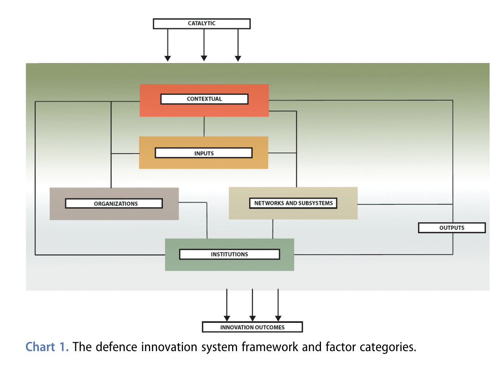
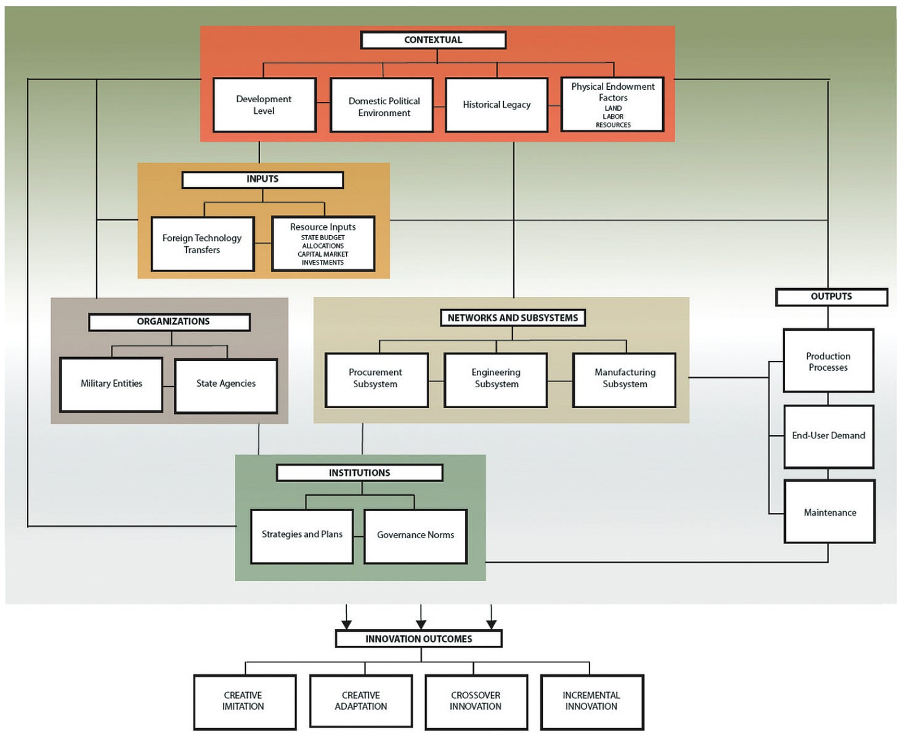
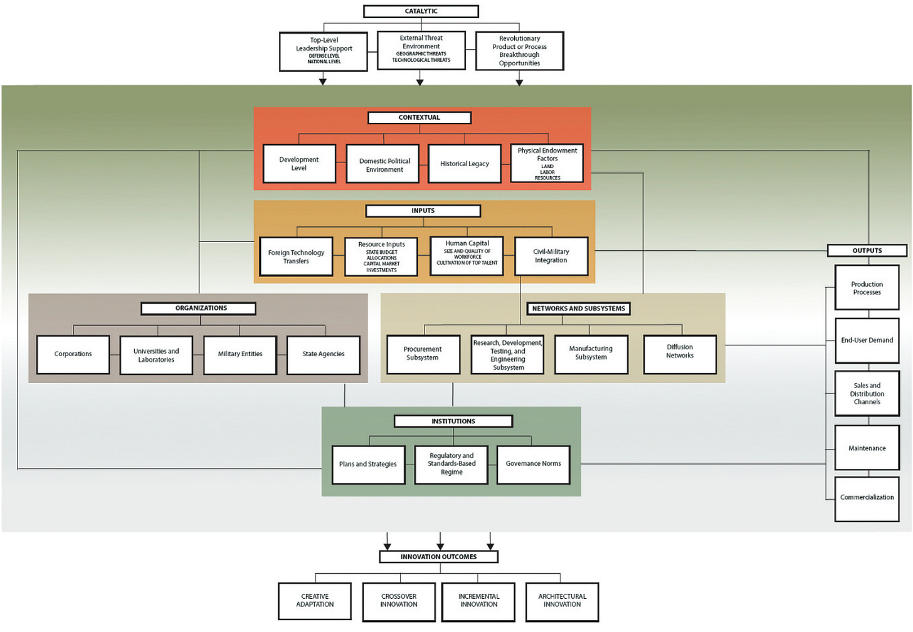

::: {.card-meta}
[Foreign Policy, Defence & Geopolitics]{.badge} [security]{.badge} [design]{.badge}
:::

> Defence innovation is not a single policy lever but a system of seven interrelated factors. Fix one without the others and the system does not move.

## Origin

This framework was developed by Tai Ming Cheung in his 2021 paper *A Conceptual Framework of Defence Innovation*, published in the *Journal of Strategic Studies*. It was applied to the Indian context in *Anticipating the Unintended*.

## What it says

{fig-alt="A Taxonomy of Defence Innovation"}

{fig-alt="A Taxonomy of Defence Innovation (detail 2)"}

{fig-alt="A Taxonomy of Defence Innovation (detail 3)"}

Cheung breaks defence innovation into seven factor types:

- **Catalytic:** external threats, top-level leadership, breakthrough opportunities.
- **Contextual:** historical legacy, development level, market size.
- **Input:** technology transfers, budgets, human capital, civil-military integration.
- **Organisational:** capabilities of agencies delivering defence products.
- **Institutional:** norms, strategies, IP protection, government-market relations.
- **Networks:** formal and informal links between sub-systems.
- **Output:** sales, commercialisation, maintenance.

Countries fall into regime types. India has historically been an **incremental catch-up regime**: parsing inputs through state organisations and institutions to produce gradual improvements. **Rapidly catching-up regimes** like China and North Korea are pushed by catalytic factors toward heavy R&D investment and resource allocation.

## Applied

- When diagnosing why India's defence innovation is slower than its strategic needs demand.
- When identifying which factor is the current binding constraint — catalytic, organisational, or input.
- When comparing national innovation systems across countries.

## When it falls short

The framework provides a snapshot of a dynamic system. Organisational factors — historically India's weakest link — are the hardest to change. It also assumes a largely state-led model and may underweight private-sector and startup-driven innovation.

## Related frameworks

- [[Decoupling Dynamics]](../foreign-policy-defence-geopolitics/decoupling-dynamics.qmd) — the geoeconomic context shaping technology access.
- [[Human Capital Investment Model for National Security]](../foreign-policy-defence-geopolitics/human-capital-investment-model-for-national-security.qmd) — the input-factor view of security capacity.
- [[What Makes an Asset Strategic?]](../foreign-policy-defence-geopolitics/what-makes-an-asset-strategic.qmd) — how strategic value is assigned to outputs.

## Further reading

- [Original newsletter essay](https://publicpolicy.substack.com/p/237-looking-under-the-hood)

::: {.attribution}
Originally explored in [*A Framework a Week: A Taxonomy of Defence Innovation*](https://publicpolicy.substack.com/p/237-looking-under-the-hood) on *Anticipating the Unintended*.
:::
