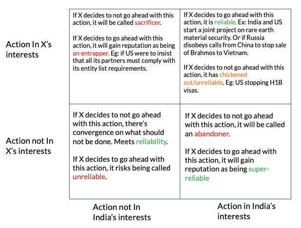

::: {.card-meta}
[Foreign Policy, Defence & Geopolitics]{.badge} [strategic autonomy]{.badge} [reliability]{.badge}
:::

> Strategic autonomy is a function of power. To gain more power, it's better to partner with a stronger partner who can build your capability.

## Origin

This framework was developed by Pranay Kotasthane in early 2022, as Russia-Ukraine tensions forced India's strategic community to confront a long-festering question: what does the India-Russia relationship actually deliver? The title riffs on the famous Bollywood song to ask — in the language of realist international relations — what Russia is to India, and what India is to Russia.

## What it says

{fig-alt="Aap Hamaare Hain Kaun, Russia?"}

The framework addresses three persistent objections to rebalancing India's foreign policy away from Russia:

- **Objection 1: Russia is necessary for strategic autonomy.** The counter: autonomy is a function of power, not diplomatic equidistance. Partnering with a stronger partner (the US) who can build Indian capability increases autonomy; clinging to a weaker partner for the sake of proving independence is the opposite of strategic thinking.

- **Objection 2: Russia has been a reliable partner.** The counter: reliability should be measured by impact on India's interests, not sentiment. The 1971 Soviet deployment came after India had effectively allied with the USSR via the Indo-Soviet Treaty — it was reliable in a loose sense, not a self-sacrificing one.

- **Objection 3: India is dependent on Russian weapons.** This is the only real constraint. The framework argues for two immediate responses: diversify the trade relationship so India can deter Russian denial of equipment through quid pro quo; and reduce defence dependence by buying from partners with whom India has broader partnerships.

A reliability-perception matrix sits at the heart of the framework: the strictest test of reliability is when a state takes self-harming action in India's interest. By that test, Russia has rarely qualified.

## Applied

India's defence trade with Russia remains massively concentrated — around $10 billion annually, with the balance in Russia's favour. India trades more with Venezuela, Belgium and South Africa than with Russia. This concentration is a vulnerability, not a strength.

The framework points to a clear rebalancing strategy: buy defence equipment from countries with whom India has broad and deep trade relations (the US, France, Israel); failing that, build such relations with the arms supplier. Russia falls into the latter category, and the bilateral relationship has not grown beyond the defence lane.

## When it falls short

The framework correctly diagnoses the long-term problem but understates the short-term pain of transition. India's military operates Russian-origin platforms across all three services; rip-and-replace is neither quick nor cheap. The framework also assumes the US will remain a willing and reliable supplier across sensitive technologies — an assumption that US politics periodically tests.

## Related frameworks

- [Paradoxes of India's Westernophobia](paradoxes-of-indias-westernophobia.qmd) — the emotional barriers to closer US alignment that this framework confronts directly.
- [Three Schools of Thought on India–US Relations](three-schools-of-thought-on-indiaus-relations.qmd) — the broader debate about how close India should get to the US.

::: {.attribution}
Originally explored in [*A Framework a Week: Aap Hamaare Hain Kaun, Russia?*](https://publicpolicy.substack.com/i/48867145/matsyanyaaya-aap-hamaare-hain-kaun-russia) on *Anticipating the Unintended*.
:::
