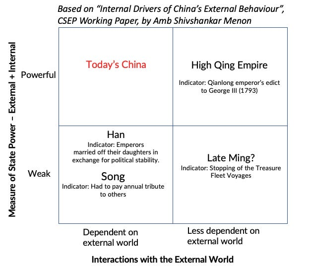

::: {.card-meta}
[Foreign Policy, Defence & Geopolitics]{.badge} [power-dependence]{.badge} [China]{.badge}
:::

> China is more powerful than ever before but is also more dependent on the world. This is an unprecedented combination, not known in Chinese history.

## Origin

The framework comes from Ambassador Shivshankar Menon's 2022 CSEP working paper *Internal Drivers of China's External Behaviour*, adapted by Pranay Kotasthane for the *A Framework a Week* series. It captures a structural insight about China that is easy to miss: its unprecedented combination of high power and high dependence on the global system.

## What it says

{fig-alt="China's Predicament"}

The framework can be visualised as a 2x2:

| | Low dependence on world | High dependence on world |
|---|---|---|
| **High domestic power** | Qing dynasty; self-sufficient empire | **China today** — unfamiliar territory |
| **Low domestic power** | Han dynasty; buying off the Xiongnu | Song dynasty; one among equals |

China's predicament is that it finds itself in the high-power, high-dependence quadrant for the first time in its history. This explains much of its current external behaviour:

- **Belligerence in the Himalayas and South China Sea:** High dependence on adversaries for technology and markets creates insecurity; high domestic power gives China the confidence (or over-confidence) to act assertively.

- **Drive towards self-reliance:** The dependence on adversaries motivates a push for indigenous capability in semiconductors and other critical technologies. High domestic power gives China the fiscal and organisational capacity to attempt this at scale.

- **Muted retaliation to US export controls:** China's political establishment appears confident it can overcome dependence in due course, while taking advantage of the pressure to consolidate domestic capabilities.

## Applied

For India, the framework suggests that China's behaviour is not merely aggressive but structurally driven. It is not a temporary phase that will pass with better diplomacy. The high-dependence dimension means China is vulnerable to supply-chain disruptions and technology denial; the high-power dimension means it has the capacity to absorb pain and persist.

India's strategy should account for both: exploit China's dependencies where possible (semiconductor supply chains, critical minerals, maritime chokepoints) while not underestimating China's ability to endure short-term costs for long-term gain.

## When it falls short

The framework is a structural snapshot, not a predictive model. It does not tell us how long China can sustain the pain of decoupling, or whether its domestic power is as high as it appears. A severe economic slowdown or internal political fracture could shift China into a different quadrant. The framework also does not specify how India should calibrate its responses across different domains.

## Related frameworks

- [Decoupling Dynamics](decoupling-dynamics.qmd) — the mechanics of the economic separation that China's predicament is accelerating.
- [Responding to LAC Standoff in Ladakh](responding-to-lac-standoff-in-ladakh.qmd) — tactical options for dealing with Chinese land-grab behaviour.

::: {.attribution}
Originally explored in [*A Framework a Week: China's Predicament*](https://publicpolicy.substack.com/i/89720005/a-framework-a-week-chinas-predicament) on *Anticipating the Unintended*.
:::
