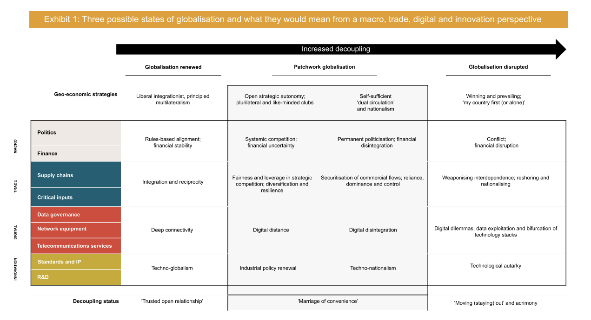

::: {.card-meta}
[Foreign Policy, Defence & Geopolitics]{.badge} [geoeconomics]{.badge} [supply-chains]{.badge}
:::

> The US-China confrontation is likely to play out over critical and emerging technology and not over finance and industrial production.

## Origin

This framework draws on a report by the European Union Chamber of Commerce in China and the Mercator Institute for China Studies (MERICS), adapted by Pranay Kotasthane for the *A Framework a Week* series. It breaks down the abstract idea of "decoupling" into concrete, analysable layers.

## What it says

{fig-alt="Decoupling Dynamics"}

Decoupling is not a single switch but a multi-layer process across four categories and nine layers:

**Macro decoupling:** political and financial

**Trade decoupling:** supply chains and critical inputs

**Innovation decoupling:** research and development, and standards

**Digital decoupling:** data governance, network equipment and telecommunications services

Of these, three layers are of highest concern: decoupling of **critical inputs** (semiconductors, software, rare earths), decoupling of **data governance regimes**, and decoupling of **standards**. Financial decoupling is less likely because of China's inability to internationalise the renminbi and its continued dependence on the US dollar even for Belt and Road projects.

The framework visualises three scenarios for how decoupling across these layers might play out — from selective separation in sensitive technologies to broader bifurcation across multiple domains.

## Applied

For India, the framework clarifies where to focus. India's opportunity lies in the layers where decoupling is most advanced and where India has credible capacity: critical inputs (pharmaceuticals, some electronics), digital governance (data localisation, privacy frameworks), and standards-setting (5G, AI ethics).

The framework also warns against over-reading decoupling as complete separation. In finance and industrial production, interdependence will persist for years. India should not assume that supply chains will automatically relocate; it must compete for them actively.

## When it falls short

The framework is descriptive, not prescriptive. It tells us what is decoupling and at what speed, but not how India should respond in each layer. It also assumes a relatively linear progression; in reality, decoupling can reverse in some layers (financial) even as it accelerates in others (semiconductors).

## Related frameworks

- [China's Predicament](chinas-predicament.qmd) — the structural driver of decoupling behaviour.
- [India's Approach Towards Chinese Firms](indias-approach-towards-chinese-firms.qmd) — how India should calibrate its economic relationship during decoupling.

::: {.attribution}
Originally explored in [*A Framework a Week: Decoupling Dynamics*](https://publicpolicy.substack.com/i/31560112/matsyanyaaya-decoupling-dynamics) on *Anticipating the Unintended*.
:::
