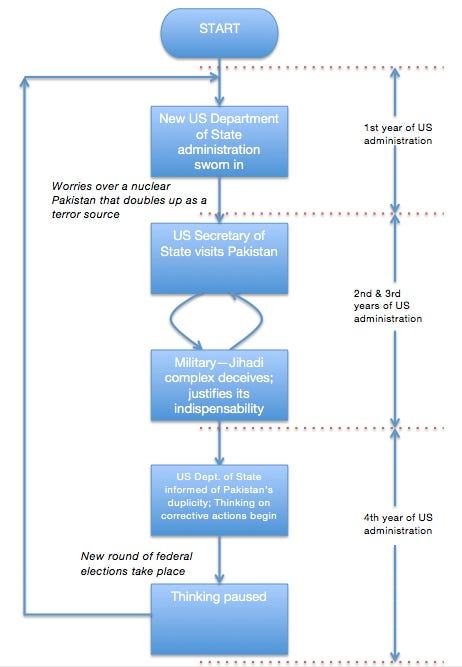

::: {.card-meta}
[Foreign Policy, Defence & Geopolitics]{.badge} [US-Pakistan]{.badge} [inconsistency]{.badge}
:::

> The Pakistani military-jihadi complex has proved its importance to the US in Afghanistan. Though the heady days of US-Pakistan bonhomie are still not quite back, the complex continues to assert its geostrategic importance.

## Origin

This framework was distilled by Pranay Kotasthane from former US Ambassador to India Robert Blackwill's frustration with US policy towards Pakistan, featured in the *Matsyanyaaya* section of *Anticipating the Unintended*.

## What it says

{fig-alt="Flakiness in US Pakistan Policy"}

The core insight is a pattern, not a single decision. US policy towards Pakistan oscillates between pressure and accommodation in a predictable cycle:

1. **Crisis or need arises** (Cold War containment, Afghan jihad, War on Terror).
2. **US arms and funds Pakistan** to serve immediate strategic purposes.
3. **Pakistan's military-jihadi complex leverages this support** to consolidate domestic power and pursue regional ambitions against India.
4. **US discovers the downside** — terrorism, nuclear proliferation, instability — and imposes sanctions or cuts aid.
5. **A new crisis arises**; the cycle restarts with renewed US engagement.

Blackwill's flowchart captures this loop: each time, the Pakistani military-jihadi complex proves its "importance" to the US in some theatre, and the US resets the relationship despite having been burned before.

## Applied

The framework explains why US training programme suspensions and resumptions — like the 2019-20 episode — are not aberrations but features of the relationship. For India, the implication is that betting on a permanent US crackdown on Pakistan is unwise. The structural incentives of US policy will always create openings for Pakistan's military to reassert relevance.

The better Indian strategy is not to lobby for US toughness on Pakistan but to make India's own countermeasures more robust — and to ensure that India-US cooperation does not become hostage to Pakistan's ability to manufacture crises.

## When it falls short

The framework assumes US strategic myopia is constant. It does not account for the possibility of a structural break — for instance, if the US were to withdraw entirely from the Middle East and South Asia, Pakistan's geostrategic relevance would collapse. The framework also does not explain why India has been unable to exploit the same cycle to its own advantage.

## Related frameworks

- [Dictatorship and Democracy in Israel and Pakistan](dictatorship-and-democracy-in-israel-and-pakistan.qmd) — how Pakistan's military-jihadi complex acquired the capacity to play this game.

## Further reading

- Hussain, Rizwan. *Pakistan and the Emergence of Islamic Militancy in Afghanistan*. Ashgate, 2005.

::: {.attribution}
Originally explored in [*A Framework a Week: Flakiness in US Pakistan Policy*](https://publicpolicy.substack.com/i/202594/matsyanyaaya) on *Anticipating the Unintended*.
:::
