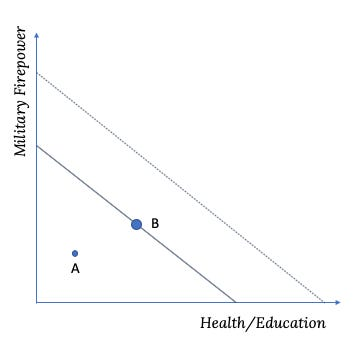

::: {.card-meta}
[Foreign Policy, Defence & Geopolitics]{.badge} [budget]{.badge} [trade-offs]{.badge}
:::

> If too large a proportion of the state's resources is diverted from wealth creation and allocated instead to military purposes, that is likely to lead to a weakening of national power over the longer term.

## Origin

The framework comes from Paul Kennedy's classic *The Rise and Fall of the Great Powers* (1987), applied by Pranay Kotasthane to India's COVID-19-era budget debates. Kennedy's core argument is that wealth is needed to underpin military power, and military power is needed to protect wealth — but overextension on either front weakens the state.

## What it says

{fig-alt="Guns and Butter"}

The "guns vs butter" debate in India has made a comeback in the argument that defence expenditure must be contained to make fiscal space for health and education. The framework reframes this as a false dichotomy.

India's government spending is roughly 26 per cent of GDP. Of this, defence (~2.1 per cent), public health (~1.4 per cent) and education (~4.6 per cent) together account for only about 8 per cent of GDP. The remaining ~18 per cent goes to other expenditures — subsidies, government administration, social welfare, and interest payments.

The framework argues that India is not at point B (where guns and butter already consume the budget) but at point A (where both are underfunded relative to the budget constraint). The solution is not to trade off defence against health and education, but to scrutinise the remaining ~18 per cent for inefficiency and irrational expenditure.

A major culprit: pay and pension bills. For the defence forces, pay and pensions have climbed to nearly 60 per cent of costs, forcing weapon purchase freezes. For the railways, the figure is two-thirds. These are not guns or butter; they are structural drains.

## Applied

The framework suggests that India's fiscal problem is misdiagnosed when framed as a defence-versus-social-sector trade-off. Both need more money. The COVID-19 crisis was an opportunity to reconsider irrational expenses — not to pit the military against public health, but to ask why administrative overheads consume so much of the state's resources.

## When it falls short

The framework assumes that savings from administrative reform are politically achievable. In practice, pay commissions, pension liabilities, and subsidy entrenchment are among the hardest expenditures to cut. It also does not resolve the temporal trade-off: some investments in defence have long gestation periods, while health and education needs are immediate.

## Related frameworks

- [Human Capital Investment Model for National Security](human-capital-investment-model-for-national-security.qmd) — a specific proposal for reducing defence pension outflows while preserving capability.

## Further reading

- Kennedy, Paul. *The Rise and Fall of the Great Powers: Economic Change and Military Conflict from 1500 to 2000*. Random House, 1987.

::: {.attribution}
Originally explored in [*A Framework a Week: Guns and Butter*](https://publicpolicy.substack.com/i/406598/a-framework-a-week-guns-and-butter) on *Anticipating the Unintended*.
:::
