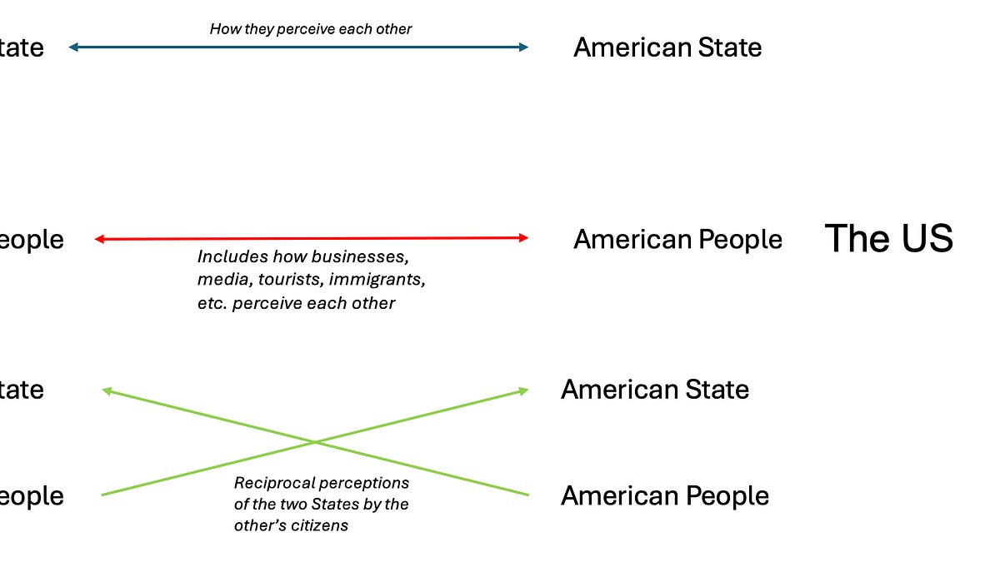

::: {.card-meta}
[Foreign Policy, Defence & Geopolitics]{.badge} [democracies]{.badge} [perception]{.badge}
:::

> While it may be true that two democracies are less likely to go to war, it is also far tougher to grow a budding partnership between two democracies in today's open information environment.

## Origin

This framework was developed by Pranay Kotasthane in the *Matsyanyaaya* section of *Anticipating the Unintended*, building on an earlier three-pillar model of bilateral relationships (state-to-state, state-to-people, people-to-people).

## What it says

{fig-alt="How Democratic States Perceive Each Other"}

Any bilateral relationship has three pillars:

1. **State-to-state relations:** The official diplomatic and strategic partnership.
2. **State-to-people relations:** How each state's government is perceived by the other state's citizens.
3. **People-to-people relations:** Cultural, economic, and educational ties between populations.

In the India-US case, the people-to-people pillar has always been the driving force, while state-to-state relations have improved significantly over the past decade. But the **state-to-people pillar has always been the weak link**.

The framework adds a crucial insight: in the Information Age, every issue is global by default, and cross-cutting narratives amplify the negative aspects of one state to the other state's citizens. Indian narratives about the US as hypocritical and unreliable coexist with American narratives about India as a failing, oppressive democracy. Both are amplified by social media.

The corollary: for the partnership to be sustained, improvements on the state-to-state and people-to-people pillars must collectively exceed the downward drag from the state-to-people pillar.

## Applied

For India-US relations, the framework explains why high-level diplomacy and diaspora warmth do not automatically translate into public trust. It also explains why authoritarian states have an asymmetric advantage: what Saudi citizens think of the US matters less because they cannot influence their regime's foreign policy; and the Chinese state can control — to a limited extent — how it is perceived abroad.

The framework suggests that India and the US should invest specifically in the state-to-people pillar: transparent communication, pre-emptive briefing on sensitive stories, and consistent messaging that acknowledges disagreements without letting them dominate the narrative.

## When it falls short

The framework treats democracies as a uniform category. In practice, a stable liberal democracy (the US, Germany) and a newer, less institutionalised democracy (India, Brazil) face very different state-to-people challenges. It also does not tell us how much investment in the other two pillars is needed to compensate for a deteriorating state-to-people pillar.

## Related frameworks

- [Paradoxes of India's Westernophobia](paradoxes-of-indias-westernophobia.qmd) — the specific emotional and historical barriers in the India-US state-to-people relationship.
- [Three Schools of Thought on India–US Relations](three-schools-of-thought-on-indiaus-relations.qmd) — the strategic debate that sits above these perceptual dynamics.

## Further reading

- Kotasthane, Pranay. *Matsyanyaaya: How do Democratic States Perceive Each Other?* Anticipating the Unintended, 2024.

::: {.attribution}
Originally explored in [*A Framework a Week: How do Democratic States Perceive Each Other?*](https://publicpolicy.substack.com/i/144296102/matsyanyaaya-how-do-democratic-states-perceive-each-other) on *Anticipating the Unintended*.
:::
