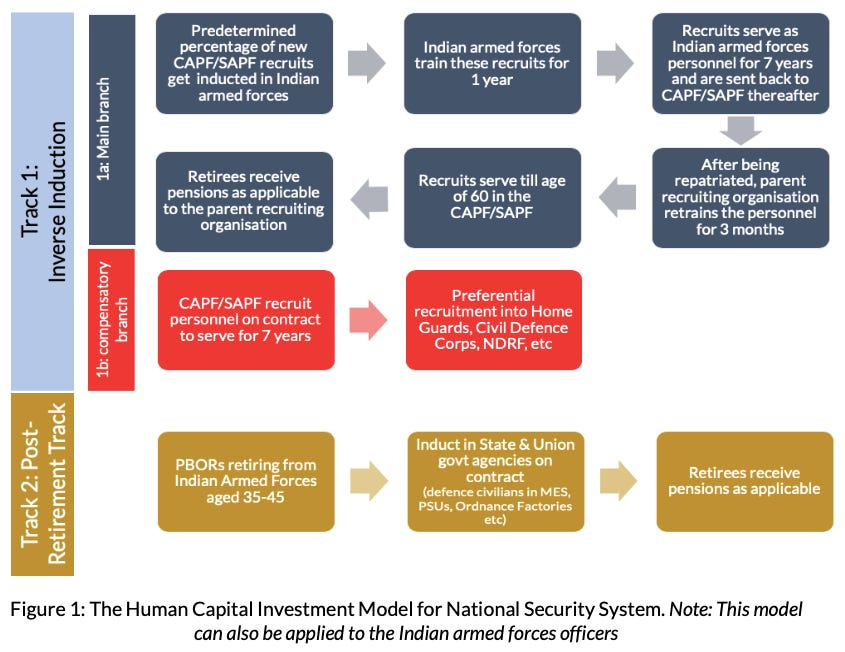

::: {.card-meta}
[Foreign Policy, Defence & Geopolitics]{.badge} [defence-reform]{.badge} [pensions]{.badge}
:::

> In FY 2019-20, out of every 1 rupee budgeted for defence, 25 paise went towards pensions alone — while only 22 paise was used for procuring weapons.

## Origin

This framework was proposed by Lt Gen Prakash Menon and Pranay Kotasthane in response to India's ballooning defence pension bill. It offers a way to reduce pension outflows while preserving national security capability through lateral movement of personnel.

## What it says

{fig-alt="Human Capital Investment Model for National Security"}

India's defence pension expenditure has more than doubled since the introduction of One Rank One Pension (OROP) in 2015 — from ₹54,000 crores to over ₹1.12 lakh crores. Sane & Shah estimate the net present value of this future liability at nearly 50 per cent of India's GDP.

The obvious solution — applying the National Pension System (NPS) to incoming defence personnel — faces political and organisational resistance. The NPS, introduced for civilian employees in 2004, is a defined-contribution scheme where the pension is paid out of a corpus the employee creates. The government's masterstroke was making it applicable only to new recruits (disarming unions) and framing the government contribution as a 10 per cent salary hike.

The Human Capital Investment Model proposes an alternative path: operationalise **lateral hiring** of defence personnel into other forces within India's national security system — paramilitary forces, police, intelligence agencies, and disaster response units. This would:

- Reduce the pension outflow by extending service years outside the defence pension system.
- Preserve human capital by retaining trained personnel within the national security apparatus.
- Build cross-organisational expertise and interoperability.

## Applied

The model requires structural changes: common training standards, transferable service records, and political agreement among ministries (Home, Defence, Intelligence) to accept lateral entrants. The framework argues that these are achievable if the alternative — a pension bill that crowds out weapons procurement — is made vivid enough.

France's 2020 pension reform protests show how politically fraught this is. India's advantage is that it can learn from France's sequencing mistakes and design a transition that protects existing retirees while changing the structure for new entrants.

## When it falls short

The model assumes that other security forces can absorb large numbers of military personnel without friction. In practice, organisational cultures, rank structures, and union politics create resistance. It also does not address the core problem of a shrinking recruitment base or the quality of training that would make laterally hired personnel valuable.

## Related frameworks

- [Guns and Butter](guns-and-butter.qmd) — the broader fiscal context that makes pension reform urgent.

## Further reading

- Menon, Prakash, & Kotasthane, Pranay. *Human Capital Investment Model for India's National Security System*. Takshashila Institution.

::: {.attribution}
Originally explored in [*PolicyWTF: Unaffordable Defence Pensions*](https://publicpolicy.substack.com/i/181699/policywtf-unaffordable-defence-pensions) on *Anticipating the Unintended*.
:::
