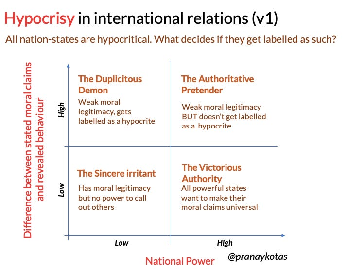

::: {.card-meta}
[Foreign Policy, Defence & Geopolitics]{.badge} [realism]{.badge} [power]{.badge}
:::

> Hypocrisy has a bad connotation, but it offers a useful middle course in the world of geopolitics; it once lubricated the engine of U.S. power.

## Origin

This framework was developed by Pranay Kotasthane in the *Matsyanyaaya* section of *Anticipating the Unintended*, drawing on a *Washington Post* article by Henry Farrell and Martha Finnemore on the value of hypocrisy in US foreign policy.

## What it says

{fig-alt="Hypocrisy in International Relations"}

In domestic politics, hypocrisy carries a moral charge because there is a moral reference point — a constitution, a legal code, a shared set of norms. In international relations, there is no such reference point. In a matsyanyaaya world, only power matters. And power determines whether other states even choose to call out a state's hypocrisy.

The framework maps states on a 2x2 of power and hypocrisy:

| | Low hypocrisy | High hypocrisy |
|---|---|---|
| **Low power** | Sincere irritant — cries hoarse at the UN, changes nothing | Easily labelled a hypocrite (India's position) |
| **High power** | Wastes moral capital; no reward for consistency | Hypocrisy goes unlabelled; can even universalise its own moral claims |

Great powers do not merely avoid the hypocrisy label. They actively seek to make their own moral claims universal so that their hypocritical acts get masked. The US attacked Iraq under the pretext of protecting democracy — a value it tried to universalise.

Artful hypocrisy requires the long-term cultivation of a reputation as a principled player. The US frequently failed to live up to its proclaimed ideals, but the gap between rhetoric and action was skillfully managed. As Farell and Finnemore note: "A world where the United States abandoned all ideals and values would be cowardly and vicious. On the other hand, a world where words and deeds always and transparently matched each other would be unworkable and probably dangerous."

## Applied

For India, the framework is liberating. India is often accused of hypocrisy — on non-alignment, on democracy promotion, on climate commitments. The framework says: in international relations, there are no rewards for being a non-hypocrite. The charge sticks because India is relatively weak, not because it is uniquely inconsistent.

The strategic implication is not to become more hypocritical, but to stop being defensive about the charge. Invest in power; the rest follows.

## When it falls short

The framework is ruthlessly realist. It understates the long-term costs of hypocrisy in a world where information flows globally and domestic publics hold governments accountable for foreign policy consistency. It also does not explain why some weak states (Nordic countries) maintain high moral standing that translates into diplomatic influence.

## Related frameworks

- [Paradoxes of India's Westernophobia](paradoxes-of-indias-westernophobia.qmd) — how India's moral positioning vis-à-vis the West creates its own hypocrisy traps.

::: {.attribution}
Originally explored in [*A Framework a Week: Hypocrisy in International Relations*](https://publicpolicy.substack.com/i/732804/matsyanyaaya-hypocrisy-in-international-relations) on *Anticipating the Unintended*.
:::
