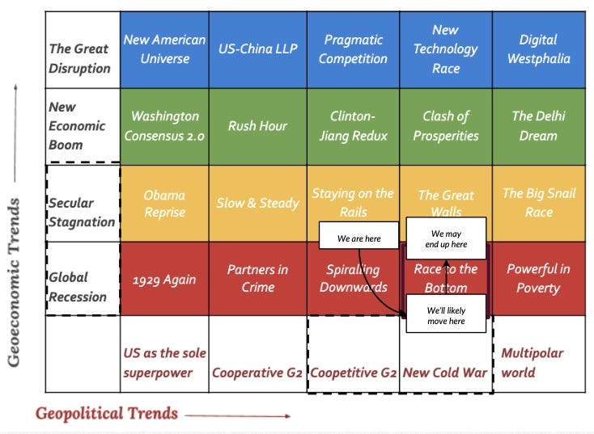

::: {.card-meta}
[Foreign Policy, Defence & Geopolitics]{.badge} [world-order]{.badge} [COVID-19]{.badge}
:::

> We are moving from one to many economic webs. One led by the US dollar, the other by China's capital, and a more diffused collection of middle powers who independently strike bargains.

## Origin

This framework was developed by Pranay Kotasthane, Akshay Alladi, Anirudh Kanisetti, and Anupam Manur in a 2020 Takshashila research publication, applying their earlier New World Order framework to the post-pandemic environment.

## What it says

{fig-alt="India and the Post-COVID-19 World Order"}

World order scenarios are at the intersection of geoeconomic trends and geopolitical trends. Using this framework, the post-COVID world maps onto a "Race to the Bottom" scenario — one of twenty scenarios imagined in 2017.

**Geopolitical axis:** Both superpowers face a decline in absolute power. Middle powers have more leverage. Smaller powers need capital, regardless of where it comes from.

**Geoeconomic axis:** A global recession in the short run, perhaps secular stagnation in the medium term. The liberal economic order is under threat and economic nationalism is back.

How this order affects India depends heavily on domestic policy reforms — welfare and healthcare systems, social harmony, and economic openness.

Two potential geopolitical stances for India:

1. **Swing power:** Maintain flexibility between US and China-led groupings.
2. **Closer alignment with the US:** Deepen the partnership across economic, technological, and security domains.

Given uncertainty, India should also invest in "small bets" — initiatives that yield option value under multiple scenarios.

## Applied

In a "Race to the Bottom" world, global labour flows become restricted and capital flows thin out. India needs another engine of growth. Large-scale manufacturing offers one such opportunity.

The framework also identifies some "dominant strategy" moves — actions India should take regardless of how the world evolves: invest in domestic manufacturing capacity, deepen ties with middle powers (Vietnam, Indonesia, Australia, UAE), and build resilient supply chains.

## When it falls short

The framework is intentionally non-predictive — a scenario matrix, not a forecast. It tells us to prepare for multiple futures but does not assign probabilities. It also underweights the possibility of a rapid global recovery or a decisive US-China détente, either of which would shift the scenario mapping.

## Related frameworks

- [Ingredients of a New World Order](ingredients-of-a-new-world-order.qmd) — the components that define any international system.
- [What Global Order Are We In?](what-global-order-are-we-in.qmd) — how to name and locate the current system.

## Further reading

- Kotasthane, P., Alladi, A., Kanisetti, A., & Manur, A. *Deriving India's Strategies for a New World Order*. Takshashila Discussion Document, 2018.

::: {.attribution}
Originally explored in [*A Framework a Week: India and the Post-COVID-19 World Order*](https://publicpolicy.substack.com/i/446462/a-framework-a-week-india-and-the-post-covid-world-order) on *Anticipating the Unintended*.
:::
