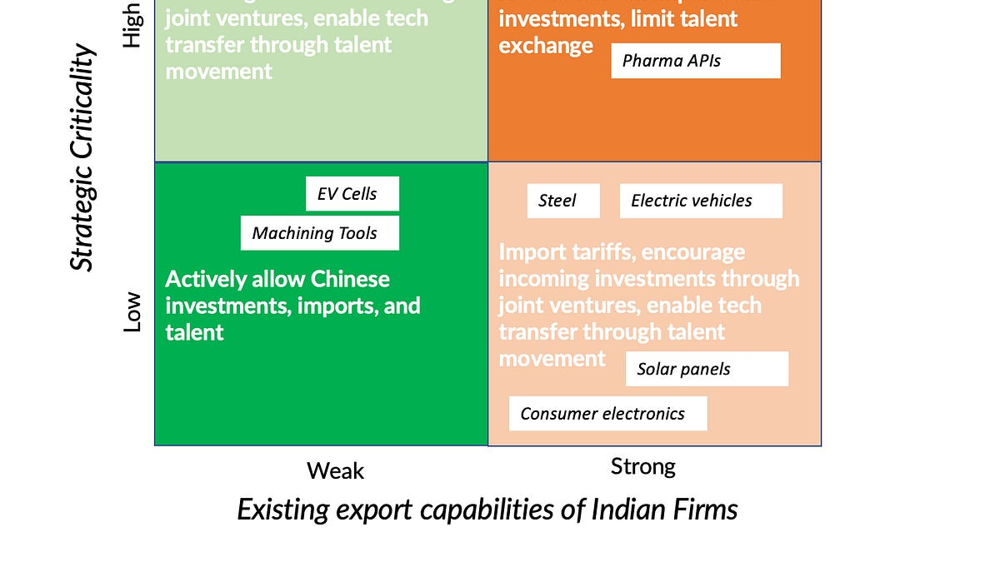

::: {.card-meta}
[Foreign Policy, Defence & Geopolitics]{.badge} [China]{.badge} [economic-security]{.badge}
:::

> Chinese firms' overcapacity fueled by government subsidies and its governance model can decimate global competition.

## Origin

This framework was developed by Pranay Kotasthane for the *India Policy Watch* section of *Anticipating the Unintended*, responding to China's industrial overproduction and its implications for India's economic security.

## What it says

{fig-alt="India's Approach Towards Chinese Firms"}

Two factors should determine India's attitude towards Chinese firms:

1. **Strategic criticality:** Is the product crucial to India's national security, defence, or information space? Are Chinese firms the only suppliers?
2. **Existing capacity of Indian firms:** Since Chinese overcapacity can destroy global competition, supporting competitive Indian firms becomes necessary. Export potential is a good indicator of competitiveness — domestic performance alone is misleading because Indian firms are often protected.

The intersection of these two factors produces four scenarios:

| | Low strategic criticality | High strategic criticality |
|---|---|---|
| **Low Indian capacity** | Welcome Chinese investment, imports, and talent | Restricted engagement; build domestic capacity urgently |
| **High Indian capacity** | Open competition | Maintain restrictions; support Indian champions |

The responses in each scenario have three prongs: investments, talent, and imports. In areas with low capability and low criticality, Chinese investments, imports, and talent (for technology transfer) should be welcome. In critical areas where Indian firms have demonstrated export competitiveness, existing restrictions should continue.

## Applied

The framework helps move India's China policy beyond blanket bans or blanket openness. For example:

- **Solar panels:** Low criticality for national security, but Indian firms have struggled. A calibrated tariff or local-content requirement may be justified.
- **5G equipment:** High criticality for information space; restrictions on Huawei and ZTE are consistent with the framework.
- **Machining tools:** The criticality is debatable; the framework insists this debate be had explicitly rather than defaulting to either openness or restriction.

## When it falls short

The framework depends on accurate assessments of both "strategic criticality" and "Indian capacity" — both are politically contested and technically difficult. It also does not specify the time horizon: should restrictions be temporary until Indian capacity builds, or permanent? Finally, it does not address the WTO compatibility of many restrictive measures.

## Related frameworks

- [Decoupling Dynamics](decoupling-dynamics.qmd) — the broader context of economic separation from China.
- [What Makes an Asset Strategic?](what-makes-an-asset-strategic.qmd) — how to assess "strategic criticality" rigorously.

## Further reading

- Economic Survey of India, 2023–24. Chapter on Chinese investments.

::: {.attribution}
Originally explored in [*India Policy Watch: A Framework for India's Approach Towards Chinese Firms*](https://publicpolicy.substack.com/i/147546599/india-policy-watch-a-framework-for-indias-approach-towards-chinese-firms) on *Anticipating the Unintended*.
:::
