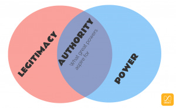

::: {.card-meta}
[Foreign Policy, Defence & Geopolitics]{.badge} [world-order]{.badge} [legitimacy]{.badge}
:::

> While the survival of nation-states depends on power alone, achieving a world leader status requires both power and legitimacy.

## Origin

This framework draws on Henry Kissinger's 2014 book *World Order*, adapted by Pranay Kotasthane for the *A Framework a Week* series. It unpacks the often-vague phrase "new world order" into analysable components.

## What it says

{fig-alt="Ingredients of a New World Order"}

Kissinger defines world order as "the concept held by a region or civilisation about the nature of just arrangements and the distribution of power thought to be applicable to the entire world." Two words matter: **just** and **power**.

Any world order rests on two components:

1. **A set of commonly accepted rules** that define the limits of permissible action (legitimacy).
2. **A balance of power** that enforces restraint where rules break down.

The critical distinction is between **power** and **authority**. Power is the ability to influence others irrespective of their will. Authority is the exercise of power that is deemed legitimate. Great power status is the quest for authority.

Kissinger again: "To strike a balance between the two aspects of order — power and legitimacy — is the essence of statesmanship. Calculations of power without a moral dimension will turn every disagreement into a test of strength. Moral proscriptions without concern for equilibrium tend toward crusades or impotent policy."

**Why the US-led order is crumbling:** The US continues to be powerful, but its conduct — withdrawing from TPP, reversing the Iran deal, leaving the Paris Agreement — has eroded its legitimacy. Benefits to allies have declined; multilateral credibility has taken a hit.

**Why China cannot easily replace it:** Even if China's power rivals the US, it lacks a vision beyond Westphalian non-interference. Its hierarchical worldview divides the world between "civilisation" and "non-civilisation," making *Pax Sinica* repulsive to most states.

## Applied

For India, the framework is encouraging. India scores lower than China on power but better on legitimacy. As Shyam Saran argues, India's cosmopolitan culture, pluralism, and democratic construction give it civilisational attributes for contributing to a new international order.

The twin challenge: preserve the values that generate legitimacy while aggressively adding to power capabilities. India cannot trade one for the other.

## When it falls short

The framework is better at diagnosing orders than at building them. It does not specify how a middle power like India converts legitimacy into institutional influence. It also assumes that legitimacy is a stable resource; in practice, it can be eroded quickly by domestic political choices.

## Related frameworks

- [What Global Order Are We In?](what-global-order-are-we-in.qmd) — how to locate the current system on the map.
- [India and the Post-COVID-19 World Order](india-and-the-post-covid-19-world-order.qmd) — scenario planning for India's path.

## Further reading

- Kissinger, Henry. *World Order*. Penguin, 2014.
- Saran, Shyam. *How India Sees the World*. Juggernaut, 2017.

::: {.attribution}
Originally explored in [*A Framework a Week: Ingredients of a New World Order*](https://publicpolicy.substack.com/i/368483/a-framework-a-week-ingredients-of-a-new-world-order) on *Anticipating the Unintended*.
:::
