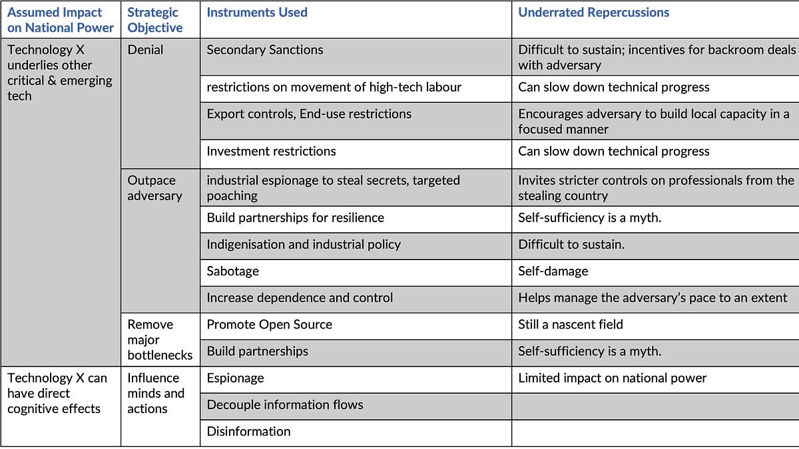

::: {.card-meta}
[Foreign Policy, Defence & Geopolitics]{.badge} [security]{.badge} [technology]{.badge}
:::

> The old logic of technology geopolitics — keep your adversary dependent on your core technology so you can control their progress — has collapsed. Both sides are now racing to decouple.

## Origin

This framework was developed by Pranay Kotasthane in a Takshashila Working Paper on high-technology geopolitics, and draws on Ansgar Baums and Nicholas Butts' book *Tech Cold War*.

## What it says

{fig-alt="Instruments of Technology Geopolitics"}

Nation-states deploy a range of politico-economic instruments in the technology domain. The critical shift of recent years is the abandonment of "dependence and control" as a strategy. As technology moved to the centre of geopolitics, the US and China both began blocking each other's access to advanced chips, AI models, and critical minerals.

The book maps specific tools — export controls, investment screening, standards-setting, data localisation — to strategic ends, showing how the same instrument can be used for control, denial, or acceleration depending on context.

The unintended consequence is substitution: when OpenAI blocked Chinese users and the US blocked chip exports, China built DeepSeek. When China restricted rare earth magnets, the Quad launched a Critical Minerals Initiative. Export controls do not freeze competitors; they accelerate the development of alternatives, either domestically or through friendlier coalitions.

## Applied

- When assessing whether a technology export control will constrain or accelerate a rival's progress.
- When designing India's semiconductor and critical minerals strategy.
- When reading the US-China tech war as a dynamic game rather than a static dominance map.

## When it falls short

The framework moves quickly in a fast-evolving domain. It also assumes state-centric actors; private firms reorient themselves in ways that complicate national strategy. Finally, the substitution effect is not automatic — it depends on the targeted country's scientific base and access to alternative supply chains.

## Related frameworks

- [[Decoupling Dynamics]](../foreign-policy-defence-geopolitics/decoupling-dynamics.qmd) — the multi-layer mechanics of economic separation.
- [[India's Approach Towards Chinese Firms]](../foreign-policy-defence-geopolitics/indias-approach-towards-chinese-firms.qmd) — calibrating India's economic posture.
- [[What Makes an Asset Strategic?]](../foreign-policy-defence-geopolitics/what-makes-an-asset-strategic.qmd) — how strategic value is assigned in technology competition.

## Further reading

- Kotasthane, P. *High-Technology Geopolitics in the Post-Pandemic World*. Takshashila Working Paper.
- [Original newsletter essay](https://publicpolicy.substack.com/p/307-grasping-at-straws)

::: {.attribution}
Originally explored in [*A Framework a Week: Instruments of Technology Geopolitics*](https://publicpolicy.substack.com/p/307-grasping-at-straws) on *Anticipating the Unintended*.
:::
