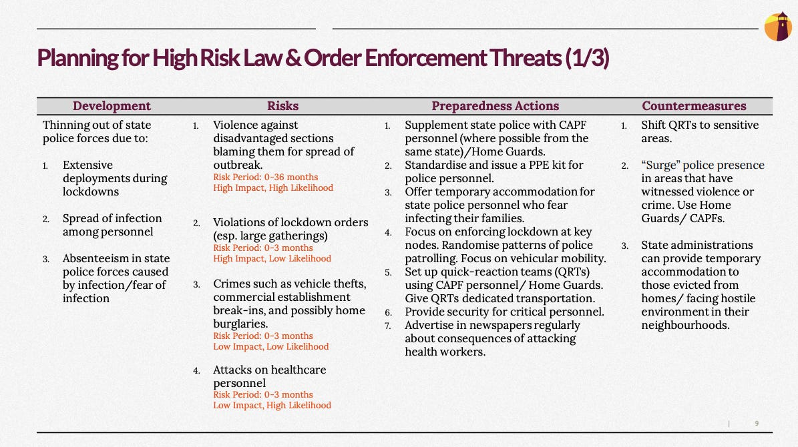

::: {.card-meta}
[Foreign Policy, Defence & Geopolitics]{.badge} [preparedness]{.badge} [contingency]{.badge}
:::

> A single development can generate multiple risks. Contingencies can also generate opportunities apart from risks.

## Origin

This framework was adapted by Pranay Kotasthane from a WHO contingency planning model, applied to India's national security situation during the COVID-19 pandemic and the simultaneous LAC standoff with China.

## What it says

{fig-alt="National Security Preparedness and COVID-19 Planning"}

Systematic contingency planning involves identifying four factors:

1. **Developments:** The underlying phenomena that cause risks to materialise. A single development can generate multiple risks.
2. **Risks:** Potential hazards that must be identified and mitigated. (Kotasthane adds that contingencies can also generate opportunities.)
3. **Preparedness actions:** Proactive steps taken in advance primarily to reduce the likelihood of a risk materialising, and secondarily to reduce its impact.
4. **Countermeasures:** Reactive steps taken to reduce or contain the impact of a risk once it has begun materialising.

Applying this to India's COVID-19 plus LAC situation revealed that policing capacity was the critical bottleneck. Police forces were deployed on lockdown management, border control, and quarantine enforcement — stretching them thin just when they might also be needed for security contingencies.

## Applied

Short-term options to surge policing capacity:

- Supplement state police forces with Central Armed Police Forces in sensitive areas.
- Offload auxiliary policing functions to the private security sector temporarily.
- Bring back retired police officers for functions that do not require much social interaction.

Long-term: the pandemic underscored the urgent need for both **policing reforms** (procedural and accountability changes) and **police reforms** (structural reorganisation of the force).

The framework also applies beyond pandemics. Climate disasters, cyber-attacks, and economic shocks all generate cascading risks that cut across departmental silos. National security planning must be generic enough to handle unexpected developments, not just scenario-specific.

## When it falls short

The framework is broad and requires detailed domain expertise to operationalise. It does not tell us how to trade off resources between preparedness and countermeasures, or how to maintain political support for expensive preparedness measures that may never be used.

## Related frameworks

- [Responding to LAC Standoff in Ladakh](responding-to-lac-standoff-in-ladakh.qmd) — the specific tactical situation that overlapped with COVID-19.

## Further reading

- World Health Organization. *Contingency Planning Framework*.

::: {.attribution}
Originally explored in [*A Framework a Week: National Security Preparedness and Planning for COVID-19*](https://publicpolicy.substack.com/i/593932/a-framework-a-week-matsyanyaaya-national-security-preparedness-and-planning-for-covid) on *Anticipating the Unintended*.
:::
