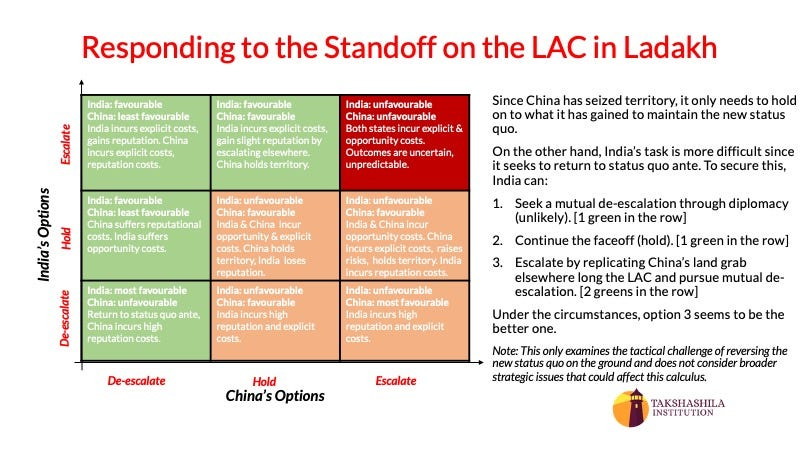

::: {.card-meta}
[Foreign Policy, Defence & Geopolitics]{.badge} [China]{.badge} [border]{.badge}
:::

> Since China has seized territory, it only needs to hold on to what it has gained to maintain the new status quo. India's task is more difficult since it seeks to return to status quo ante.

## Origin

This framework was developed by the Takshashila Institution's geostrategy team during the 2020 LAC standoff, presented by Pranay Kotasthane in the *A Framework a Week* series.

## What it says

{fig-alt="Responding to LAC Standoff in Ladakh"}

The framework evaluates India's options along the Line of Actual Control (LAC) through a simple decision matrix. Since China has seized territory, its task is easier: hold what it has gained. India's task is harder: restore the status quo ante.

Three options are on the table:

1. **Seek mutual de-escalation through diplomacy.** Unlikely, because China has no incentive to give up what it has gained without a corresponding concession.

2. **Continue the standoff.** A holding pattern that preserves Indian positions but does not reverse Chinese gains. This consumes resources and morale indefinitely.

3. **Escalate by replicating China's land grab elsewhere along the LAC, then pursue mutual de-escalation.** This raises the costs for China and creates bargaining leverage. Under the circumstances, this appears to be the better tactical option.

The framework assumes that India has tactical advantages at multiple points along the LAC that it can exploit, and that China — despite its overall military superiority — cannot bring its full strength to bear in a localized theatre without endangering other fronts.

## Applied

The framework was offered as a real-time analytical tool during the 2020 crisis. Its core insight — that India must create costs for China to have any chance of restoring status quo — remains relevant. The "replicate and negotiate" option requires careful calibration: the chosen location must be one where India can seize and hold ground with manageable risk, and the escalation must be accompanied by clear diplomatic messaging about the path to mutual de-escalation.

## When it falls short

The framework is tactical, not strategic. It does not address the underlying problem of an unsettled boundary, or the larger question of how to manage the India-China relationship over the long term. It also assumes that India has the political will to escalate — an assumption that has been tested and found uncertain in practice.

## Related frameworks

- [China's Predicament](chinas-predicament.qmd) — the structural drivers of Chinese aggression.
- [How to Deter Reasonable People from Undesirable Behaviour](how-to-deter-reasonable-people-from-undesirable-behaviour.qmd) — the behavioural logic behind deterrence design.

## Further reading

- Takshashila Institution. *Responding to the Standoff on the LAC in Ladakh*. SlideDoc, 2020.

::: {.attribution}
Originally explored in [*A Framework a Week: Responding to the Standoff on the LAC in Ladakh*](https://publicpolicy.substack.com/i/570850/a-framework-a-week-responding-to-the-standoff-on-the-lac-in-ladakh) on *Anticipating the Unintended*.
:::
