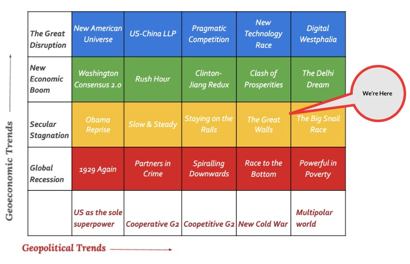

::: {.card-meta}
[Foreign Policy, Defence & Geopolitics]{.badge} [world-order]{.badge} [geopolitics]{.badge}
:::

> The global order is a function of both geopolitics and geoeconomics. Its intent is not to predict the future but to imagine the various possibilities.

## Origin

This framework was developed by Pranay Kotasthane, Anirudh Kanisetti, Anupam Manur, and Akshay Alladi in their 2018 Takshashila Discussion Document *Deriving India's Strategies for a New World Order*, and updated during the Russia-Ukraine war.

## What it says

{fig-alt="What Global Order Are We In?"}

World order scenarios are at the intersection of geoeconomic trends and geopolitical trends. Rather than asking "is the world unipolar or multipolar?" — a question that misses the geoeconomic dimension — the framework maps scenarios on two axes.

Using this framework, the current world maps onto a **"Great Walls"** scenario: stagnated global economy plus intensifying US-China conflict.

Characteristics of Great Walls:

- **Stable geopolitics, dynamic geoeconomics:** The US sees countering China as an overriding priority. Reorienting supply chains leads to secular stagnation.
- **From one to many economic webs:** A US-dollar-led web, a China-capital-led web, and a diffused collection of middle powers striking independent bargains.
- **A new age of multilateralism:** Global bodies become less important; institutions organised around powerful nation-states become more important.

The Russia-Ukraine war sharpens these trends. Russia becomes more dependent on China. The West unites against Russia and China. The world does not become more multipolar; it becomes more bifurcated.

## Applied

For India, Great Walls is a tough scenario. As long as the primary Western focus is countering China, India gains. As soon as the focus shifts to Russia, India is on weak footing — caught between military dependence on Russia and strategic convergence with the West.

India is pushed to strategic autonomy by compulsion, not by choice. The framework suggests investing in "small bets" — relationships and capabilities that yield option value across scenarios — rather than betting everything on a single alignment.

## When it falls short

The framework is deliberately non-predictive. It does not tell us which scenario is most likely, or how long Great Walls will last. It also does not give India a clear action agenda; it is a diagnostic tool, not a strategy document.

## Related frameworks

- [Ingredients of a New World Order](ingredients-of-a-new-world-order.qmd) — the components that define any international system.
- [India and the Post-COVID-19 World Order](india-and-the-post-covid-19-world-order.qmd) — domestic reforms needed to prosper in the Great Walls scenario.

## Further reading

- Kotasthane, P., Kanisetti, A., Manur, A., & Alladi, A. *Deriving India's Strategies for a New World Order*. Takshashila Discussion Document, 2018.

::: {.attribution}
Originally explored in [*Matsyanyaaya: Where Do We Go Now?*](https://publicpolicy.substack.com/i/49403859/matsyanyaaya-where-do-we-go-now) on *Anticipating the Unintended*.
:::
