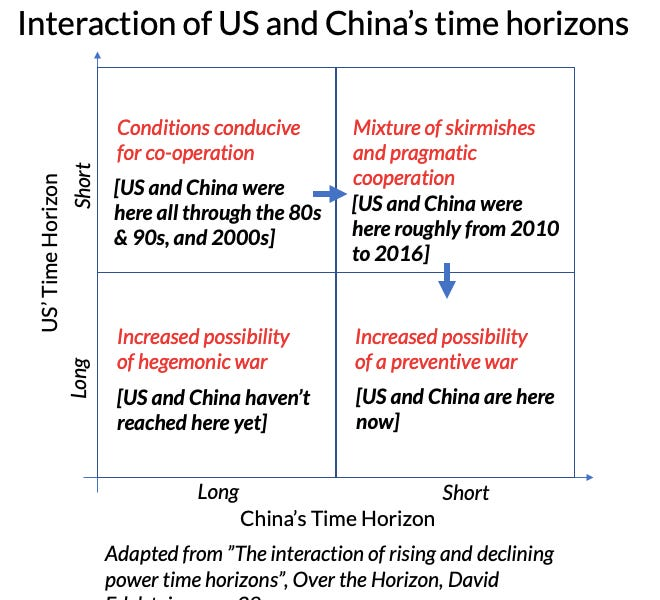

::: {.card-meta}
[Foreign Policy, Defence & Geopolitics]{.badge} [US-China]{.badge} [rise-and-fall]{.badge}
:::

> Leaders of existing great powers are disinclined to expend considerable resources on an uncertain long-term threat. When existing powers focus on the short term, mutually beneficial cooperation with rising powers becomes more likely.

## Origin

This framework comes from David Edelstein's book *Over the Horizon: Time, Uncertainty, and the Rise of Great Powers*, adapted by Pranay Kotasthane for the *A Framework a Week* series.

## What it says

Offensive realism argues that an incumbent great power should confront a rising power as soon as possible, regardless of the rising power's intentions. Yet history shows the opposite: incumbents routinely enable their own future rivals.

Edelstein explains this divergence by adding two variables to relative power: **perceived intentions** and **time horizons**.

The framework can be visualised as a 2x2 of time horizons:

{fig-alt="What Made the US Enable China's Rise"}

When a rising power has a long-term focus and the declining power has a short-term focus, cooperation is the equilibrium. This is what happened between the US and China after the Sino-Soviet split. China "hid its capacities and bided its time" (Deng Xiaoping); the US focused on short-term gains from cheap manufacturing.

By 2010, China's time horizons changed. Its aggression towards neighbours signalled short-term consolidation. The US was still focused on the short term — Iraq, Afghanistan, Russia, Iran. Result: skirmishes and pragmatic cooperation.

By 2016, the US was forced to extend its time horizon. The result: preventive "war" — direct confrontation in trade and technology, though not yet by force.

## Applied

For India, the framework explains why US support for China's WTO entry and technology transfers was not a conspiracy or a blunder but a structurally predictable choice. It also warns that preventive confrontation is not inevitable: if China were to shift back to a long-term focus, the equilibrium could change.

The framework suggests that India's own relationship with China should be calibrated by time-horizon analysis. Is China operating on a short-term or long-term horizon in a given domain? India's response should differ accordingly.

## When it falls short

The framework is better at explaining the past than predicting the future. Xi Jinping's time horizon is opaque; the framework's prediction of continued preventive confrontation assumes he remains short-term focused, which is debatable. It also does not account for domestic politics within the declining power — the US-China relationship is shaped by American electoral cycles as much as by strategic logic.

## Related frameworks

- [China's Predicament](chinas-predicament.qmd) — the structural situation China finds itself in now that its long-term focus has shifted.
- [Decoupling Dynamics](decoupling-dynamics.qmd) — the mechanics of the preventive confrontation now underway.

## Further reading

- Ramanathan, Aditya. "Book Review: Over the Horizon." Takshashila Institution.

::: {.attribution}
Originally explored in [*A Framework a Week: What Made the US Enable China's Rise?*](https://publicpolicy.substack.com/i/2848238/a-framework-a-week-what-made-the-us-enable-chinas-rise) on *Anticipating the Unintended*.
:::
