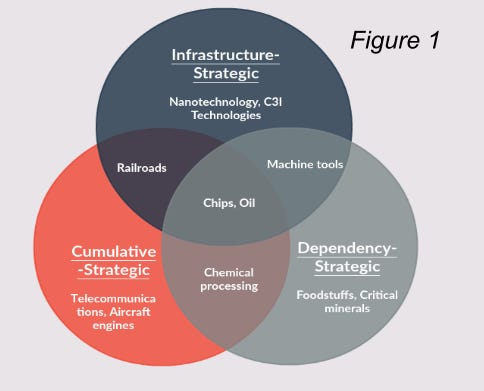

::: {.card-meta}
[Foreign Policy, Defence & Geopolitics]{.badge} [strategic-assets]{.badge} [national-security]{.badge}
:::

> The strategic level of an asset is a product of importance, externality, and nationalisation.

## Origin

This framework comes from Jeffery Ding and Alan Dafoe's paper *The Logic of Strategic Assets: From Oil to AI*, adapted by Pranay Kotasthane for the *A Framework a Week* series.

## What it says

{fig-alt="What Makes an Asset Strategic?"}

The term "strategic" is overused. Ding and Dafoe offer a precise formula:

**Strategic Level = Importance × Externality × Nationalisation**

- **Importance:** The asset's economic and/or military utility. Freight transport contributes more to growth than high-end fashion.
- **Externality:** The economic and/or security externalities that uncoordinated firms and military organisations will not optimally attend to. Foundational research has positive spillovers that private actors under-invest in.
- **Nationalisation:** The degree to which these externalities accrue to the nation and its allies, not to rivals. Medical research has positive externalities, but they diffuse easily to rivals; semiconductor fabrication does not.

These externalities crystallise into three strategic logics:

1. **Cumulative-strategic logic:** High barriers to entry, first-mover advantages, economies of scale. Example: aircraft engines (1945–present).
2. **Infrastructure-strategic logic:** Assets that generate positive spillovers across the economy or military. Example: railroads (1840–1860).
3. **Dependency-strategic logic:** Supply concentrated in limited suppliers, vulnerable to disruption. Example: nitrates during WWI.

The three logics overlap. States should pay closest attention to assets that exhibit multiple strategic logics.

## Applied

For India, the framework is a prioritisation tool. Which assets qualify as strategic?

- **Semiconductors:** High importance, high externality (foundational technology), high nationalisation (supply concentrated in US, Taiwan, South Korea). Strong on all three logics.
- **Rare earths:** High dependency logic; lower cumulative logic because processing, not mining, is the bottleneck.
- **AI:** High importance and externality; nationalisation is contested because AI research diffuses rapidly through open publication.

The framework warns against labelling everything "strategic." An asset is not strategic merely because it is important; it must also generate externalities that markets underproduce, and those externalities must be capturable by the nation.

## When it falls short

The framework is analytical, not operational. It tells us which assets are strategic but not how much a state should invest in each, or which policy instruments (subsidies, procurement, R&D) are most appropriate. It also assumes that national boundaries are the right unit of analysis; in a world of global supply chains, even "nationalised" externalities leak across borders.

## Related frameworks

- [India's Approach Towards Chinese Firms](indias-approach-towards-chinese-firms.qmd) — how to apply strategic-asset thinking to economic policy.
- [Decoupling Dynamics](decoupling-dynamics.qmd) — the process by which strategic assets become focal points of great-power competition.

::: {.attribution}
Originally explored in [*A Framework a Week: What Makes an Asset Strategic?*](https://publicpolicy.substack.com/i/9055227/a-framework-a-week-what-makes-an-asset-strategic) on *Anticipating the Unintended*.
:::
