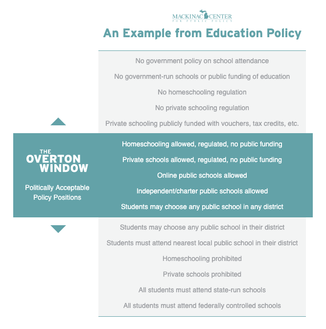

::: {.card-meta}
[Political Thinking]{.badge} [narrative]{.badge} [agenda-setting]{.badge}
:::

> Politicians do not pick from the full menu of possible positions on an issue. They pick from a narrow window of socially acceptable positions. Move that window, and you change what is sayable, electable, and eventually doable.

## Origin

The framework is named after Joseph P. Overton, a senior vice president at the *Mackinac Center for Public Policy*, an American think tank, who developed it in the mid-1990s. After Overton's death in 2003, his colleague Joseph G. Lehman extended and popularised the framework. The Mackinac Center [continues to maintain a primer](https://www.mackinac.org/OvertonWindow) on the concept.

## What it says

{fig-alt="The Overton Window"}

For any political issue, there is a range of all *possible* positions — from the most radical reform on one side to the most reactionary on the other. Within that range sits a much narrower band of *socially acceptable* positions: ideas that a politician can voice without being treated as fringe.

That band — the Overton Window — has two important properties.

```{=html}
<div style="margin: 1.5rem 0; font-family: var(--bs-font-sans-serif);">
  <div style="display:flex; justify-content:space-between; font-size:0.75rem; color:#888; margin-bottom:4px;">
    <span>← Radical</span><span>Reactionary →</span>
  </div>
  <div style="display:flex; border-radius:4px; overflow:hidden; border:1px solid #ddd; font-size:0.82rem;">
    <div style="flex:1; background:#f5f5f5; padding:0.6rem 0.5rem; text-align:center; color:#999;">Unthinkable</div>
    <div style="flex:1; background:#e8ecf2; padding:0.6rem 0.5rem; text-align:center; color:#666;">Radical</div>
    <div style="flex:2; background:#1a4480; padding:0.6rem 0.5rem; text-align:center; color:#fff; font-weight:600;">← Overton Window →<br><span style="font-weight:400; font-size:0.75rem;">Acceptable · Sensible · Popular · Policy</span></div>
    <div style="flex:1; background:#e8ecf2; padding:0.6rem 0.5rem; text-align:center; color:#666;">Radical</div>
    <div style="flex:1; background:#f5f5f5; padding:0.6rem 0.5rem; text-align:center; color:#999;">Unthinkable</div>
  </div>
  <div style="font-size:0.75rem; color:#aaa; margin-top:4px; text-align:center;">The window shifts — what is unthinkable in one decade becomes policy in the next.</div>
</div>
```

First, **it shifts over time.** What was unsayable in one decade becomes mainstream in the next. The shift is rarely the work of a single politician; it is produced by years of advocacy, intellectual work, and changing social conditions that move the centre of gravity.

Second, **it can widen or narrow.** A polarised debate widens the window: more positions become sayable, even if they are sayable mostly to attack the other side. A consensus politics narrows it: certain positions become unspeakable across the political spectrum.

The window's mechanism is social, not legal. Nothing prevents a politician from voicing an "outside the window" position — except the cost in votes, allies, and reputation.

## Applied

Air India privatisation is a clean Indian example. For decades after the 1980s, selling off a flag carrier was politically untenable across the spectrum. The Overton Window did not include "sell the airline." Privatisation was discussed by economists and editorial pages, but no government touched it.

That changed slowly through the 2000s and 2010s — through repeated losses on the airline's books, intellectual work on PSU divestment, the precedent of privatisation in telecoms and banking, and a generational shift in voters' relationship with state-owned enterprises. By 2017, when the government formally announced the sale, the Overton Window had moved to include it. The 2021 sale to the Tata Group passed with little political backlash.

The lesson for advocates: if your preferred policy is currently *outside* the window, do not aim straight for adoption. Aim first for **acceptability** — through writing, public conversation, allied policies, demonstration cases. Adoption follows acceptability, not the other way around.

## When it falls short

The framework describes the geography of politically acceptable opinion but does not explain *why* the window moves. Was it social media that shifted it? Generational replacement? An economic crisis? A charismatic political entrepreneur? The framework is silent on causation.

It also encourages a certain strategic cynicism — the idea that one should propose extreme positions in order to drag the centre. That can work, but it can also debase public debate, polarise the polity, and trap the proposer in positions they did not actually want.

Finally, the window is plural. India does not have one window; it has a Hindi-press window, an English-press window, a regional-language window, and many more. A position outside one may be inside another. The framework collapses this plurality and is most useful when applied to a specific public, not to "society" in the abstract.

## Related frameworks

- [What Makes a Good Narrative?](what-makes-a-good-narrative.qmd) — the form ideas take when they move the window.
- [Cognitive Maps Alignment](cognitive-maps.qmd) — why two people in the same window can still disagree.
- [Stakeholder Management in Public Policy](stakeholder-management-in-public-policy.qmd) — the practical work of shifting acceptability one stakeholder at a time.

## Further reading

- Mackinac Center for Public Policy, [*The Overton Window*](https://www.mackinac.org/OvertonWindow).
- Lehman, J. G. (2010). *An Introduction to the Overton Window of Political Possibility*.

::: {.attribution}
Originally explored in [*A Framework a Week: The Overton Window*](https://publicpolicy.substack.com/i/208813/a-framework-a-week-the-overton-window) on *Anticipating the Unintended*.
:::
