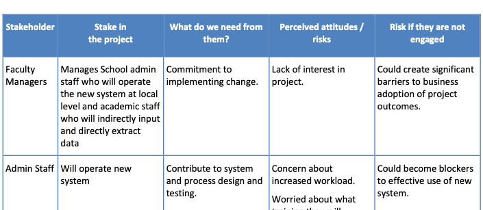
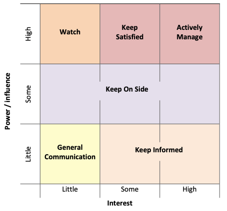
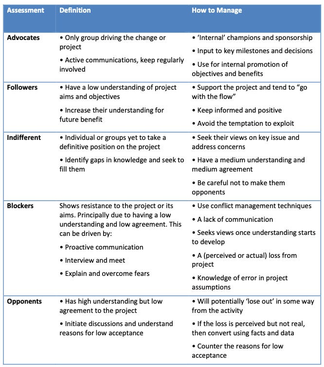
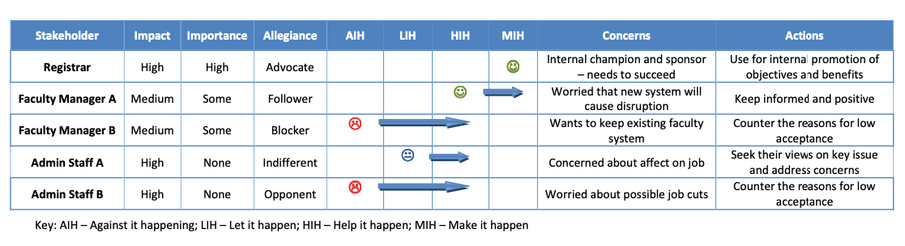

::: {.card-meta}
[Political Thinking]{.badge} [reform]{.badge} [implementation]{.badge}
:::

> Stakeholder management is a key tool for effecting policy change. The strategy spells out where you want each stakeholder to go, and how you will manage them to get them there.

## Origin

The framework was developed by Bruce Levitan of Manchester Metropolitan University as a stakeholder analysis toolkit, and was adapted for public policy by Pranay Kotasthane. Where political-economy frameworks diagnose why reforms get blocked, this one provides an operational playbook for unblocking them.

## What it says

{fig-alt="Stakeholder Management in Public Policy"}

{fig-alt="Stakeholder Management: power-interest matrix"}

{fig-alt="Stakeholder Management: allegiance spectrum"}

{fig-alt="Stakeholder Management: strategy matrix"}

Policy reform does not fail because its logic is flawed. It fails because the people who must accept, implement, or comply with it have not been mapped, understood, and moved. The framework proposes a four-step path:

**1. Identify the stakeholders.** List every actor with a stake in the change — not just the obvious ones. For each, record what they stand to gain or lose, and what you need from them (consent, resources, implementation, silence).

**2. Create a stakeholder map.** Place stakeholders on a matrix with two axes: **power** (their importance to the success of the change) and **interest** (the level of impact the change has on them). The four quadrants demand different strategies:

- *High power, high interest*: Manage closely. These are your core allies or your most dangerous opponents.
- *High power, low interest*: Keep satisfied. They can block you but may not care enough to unless provoked.
- *Low power, high interest*: Keep informed. They are vocal but not decisive; ignore them and they can become spoilers.
- *Low power, low interest*: Monitor. Do not spend scarce political capital here.

**3. Identify stakeholder allegiance.** Classify each stakeholder as a champion, supporter, neutral, opponent, or blocker. This is a dynamic judgment, not a fixed identity. A neutral today can become a champion tomorrow if the right concession is offered.

**4. Create a stakeholder management strategy.** For each stakeholder, define the target state — where you want them to move on the allegiance spectrum — and the specific actions (concessions, communications, side-payments, sequencing) that will get them there.

## Applied

The GST reform is perhaps the most systematic application of stakeholder management in modern Indian policymaking. The stakeholders were numerous: 29 state governments with different revenue bases, manufacturing states versus consuming states, large corporate taxpayers versus small traders. The centre mapped them carefully, identified the blockers (states fearing revenue loss), and designed a five-year compensation mechanism to move them from opponents to supporters. The reform took a decade not because the economics was unclear, but because the stakeholder map had to be navigated one state at a time.

Farm law reform, by contrast, suffered from a stakeholder-management failure. The government mapped some stakeholders (large farmers in Punjab and Haryana) but underestimated their power-interest position and failed to move them before the legislation was passed. A strategy that invested in moving the most powerful opponents *before* introducing the bill — rather than hoping they would accept it after the fact — might have produced a different outcome.

## When it falls short

The framework assumes stakeholders are identifiable, rational, and open to negotiation. In practice, some opposition is ideological and non-negotiable. A stakeholder who views the reform as an assault on identity or dignity will not be moved by concessions mapped on a matrix.

It also treats power and interest as static. In a fast-moving media environment, a low-power stakeholder can acquire high power overnight through viral mobilisation. The framework does not handle these phase transitions well. Finally, it is silent on the ethics of stakeholder management: when does a side-payment become a bribe, and when does managing allegiance become manipulating democratic consent?

## Related frameworks

- [Wilson's Interest Group Matrix](wilson-interest-group-matrix.qmd) — the political-economy logic that explains why some stakeholders are organised and others are not.
- [Cognitive Maps](cognitive-maps.qmd) — how stakeholders interpret the reform through different mental models.
- [Kingdon's Three Streams](kingdon-three-streams.qmd) — when the political window opens to make stakeholder management decisive.

::: {.attribution}
Originally explored in [*A Framework a Week: Stakeholder Management in Public Policy*](https://publicpolicy.substack.com/i/314829/a-framework-a-week-stakeholder-management-in-public-policy) on *Anticipating the Unintended*.
:::
