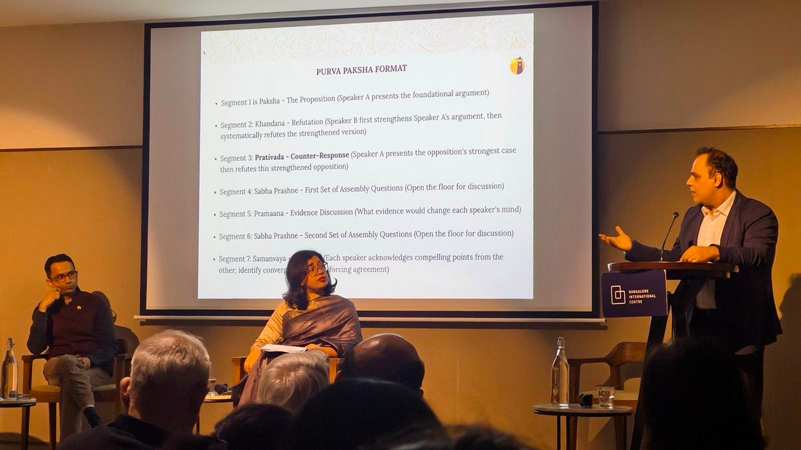

::: {.card-meta}
[Political Thinking]{.badge} [decision-making]{.badge} [narrative]{.badge}
:::

> The debate format is broken. It's geared toward winning arguments rather than understanding them.

## Origin

The framework is derived from the ancient Indian tradition of *purva paksha* — literally 'prior observation', or studying the opponent's position before constructing a response. It means strengthening an opponent's argument before refuting it. The style appears in Kautilya's *Arthashastra* and in Ambedkar's writing, and was formalised into a modern debate format by the Takshashila Institution to replace adversarial debate with structured sense-making. The format has since been adopted in schools, colleges, and workplaces as a template for high-quality discussion.

## What it says

{fig-alt="The Purva Paksha Debate"}

Purva paksha is steelmanning with discipline. A debate has seven segments: Paksha (proposition), Khandana (refutation after strengthening the opponent's case), Prativaada (counter-response), two rounds of Sabha Prashne (assembly questions), Pramaana (evidence discussion), and Samanvaya (synthesis). The goal is sense-making, not victory. Each side must articulate the other's strongest position before attacking it, and conclude by acknowledging convergence without forcing agreement. The moderator enforces structure so that refutation follows genuine restatement, not straw-manning. The synthesis segment, Samanvaya, is what distinguishes purva paksha from ordinary steelmanning — it forces convergence to be named, not assumed. The format was first tested in a debate on whether India should develop closer relations with China, hosted in partnership with the Bangalore International Centre.

## Applied

- When designing high-stakes policy deliberations where understanding trade-offs matters more than declaring winners.
- When reviewing arguments in a brief or position paper — first strengthen the opposing view, then dismantle it.
- When building institutional cultures that reward intellectual honesty over rhetorical dominance.
- When training analysts or journalists to interrogate their own assumptions before critiquing a policy.
- When structuring peer review or red-teaming exercises in policy organisations.

## When it falls short

- It demands significant time and preparation; it is ill-suited to rapid-fire media debates or Twitter exchanges.
- The format assumes good faith; it breaks down when one side is uninterested in convergence or evidence.
- In adversarial political or legal settings, the incentive to win often overwhelms the norm to understand.
- It can feel artificial to participants accustomed to adversarial formats, who may see concessions as weakness rather than rigour.
- It requires skilled moderation; without it, the format can devolve into performative restatement rather than genuine engagement.

## Related frameworks

- [[The Overton Window]](../political-thinking/overton-window.qmd)
- [[Kingdon's Three Streams]](../political-thinking/kingdon-three-streams.qmd)

## Further reading

- [Original newsletter essay](https://publicpolicy.substack.com/p/317-a-new-target)

::: {.attribution}
Originally explored in [*A Framework a Week: The Purva Paksha Debate*](https://publicpolicy.substack.com/p/317-a-new-target) on *Anticipating the Unintended*.
:::
