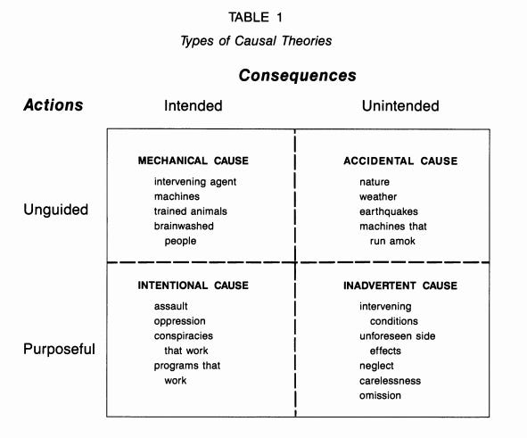

::: {.card-meta}
[Political Thinking]{.badge} [narrative]{.badge} [causality]{.badge}
:::

> In politics, causal theories are neither right nor wrong, nor are they mutually exclusive. They are ideas about causation, and policy politics involves strategically portraying issues so that they fit one causal idea or another.

## Origin

The framework comes from Deborah Stone's typology of causal stories in politics and policy, developed in her work on the policy process. Stone was interested in a puzzle: the same event — a drought, a riot, an economic slowdown — can be explained in radically different ways, and the explanation chosen determines who is blamed and what is done. Her answer was that causal stories are not neutral descriptions; they are strategic moves in a contest over responsibility.

## What it says

{fig-alt="Types of Causal Narratives"}

Stone distinguishes causal stories along two dimensions: whether the action causing the outcome was **guided or unguided**, and whether the consequence was **intended or unintended**. The resulting matrix produces four story-types, each with its own political user:

|  | **Intended** | **Unintended** |
|---|---|---|
| **Guided** | *Wilful action* — the government meant this to happen. Favoured by political opponents. | *Carelessness* — the government should have known better. Favoured by policy analysts. |
| **Unguided** | — | *Natural forces* — nobody is to blame. Favoured by governments defending their record. |

- **Unguided + Unintended (the "wrath of nature" story):** Droughts are caused by the weather; market crashes are caused by global forces. The implicit message: do not blame the government.
- **Guided + Unintended (the "carelessness" story):** The government knew droughts were regular but failed to invest in irrigation; it knew financial risks were building but omitted to regulate. The implicit message: the government is negligent, not malicious.
- **Guided + Intended (the "conspiracy" story):** The government deliberately deprived a region of water; it engineered a crash to benefit insiders. The implicit message: the government is the enemy.

The key insight is that **the act of choosing a causal story is the act of assigning responsibility**. Political conflicts over causal stories are not empirical debates about facts; they are fights about control, blame, and the legitimate scope of government action.

## Applied

Air pollution in Delhi produces all three causal stories in continuous competition. The government often deploys the unguided story: stubble burning in Punjab is a meteorological and agricultural phenomenon, not a policy failure. Policy analysts counter with the carelessness story: the government has known about crop-residue burning for years but failed to build viable alternatives or enforce bans. Political opponents invoke the conspiracy story: the government does not care because Delhi's poor, not its voters, suffer most.

The same pattern plays out across Indian policy. Was the 2016 demonetisation a bold strike against black money (guided, intended), a poorly designed shock that ignored implementation capacity (guided, unintended), or the inevitable result of a cash-dependent economy that no finance minister could truly control (unguided)? The causal story chosen by each actor predicts their policy recommendation perfectly.

## When it falls short

The framework is cynical in the best sense — it strips away the pretence that causal debates are about finding "the truth." But this cynicism can become disabling. Some causal stories *are* better supported by evidence than others, and treating all narratives as equally strategic can license a post-truth politics where evidence ceases to matter.

It also underweights genuine uncertainty. In complex systems — pandemics, financial markets, climate — causation is genuinely multi-factorial and our knowledge is incomplete. The framework pushes every ambiguity into a strategic box, leaving no room for "we do not yet know."

## Related frameworks

- [What Makes a Good Narrative?](what-makes-a-good-narrative.qmd) — the craft of making a causal story compelling and politically effective.
- [Cognitive Maps](cognitive-maps.qmd) — why different actors prefer different causal stories in the first place.
- [The Overton Window](overton-window.qmd) — which causal stories are sayable in public at any given moment.

## Further reading

- Stone, D. (2012). *Policy Paradox: The Art of Political Decision Making*. W. W. Norton.

::: {.attribution}
Originally explored in [*A Framework a Week: Types of Causal Narratives*](https://publicpolicy.substack.com/i/162458/a-framework-a-week) on *Anticipating the Unintended*.
:::
