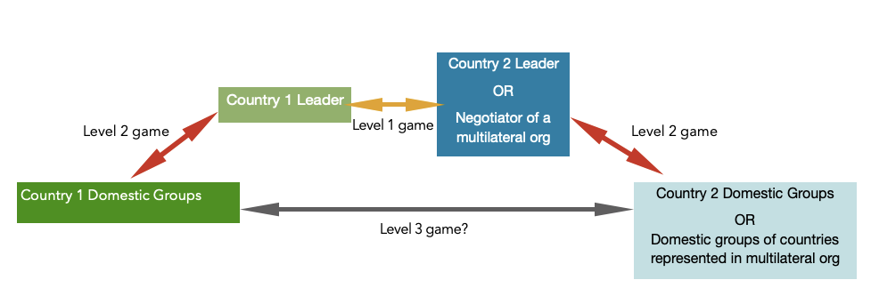

::: {.card-meta}
[Political Thinking]{.badge} [international-relations]{.badge} [negotiation]{.badge}
:::

> Any key player at the international table who is dissatisfied with the outcome may upset the game board, and conversely, any leader who fails to satisfy his fellow players at the domestic table risks being evicted from his seat.

## Origin

The framework comes from Robert Putnam's landmark 1988 paper *Diplomacy and Domestic Politics: The Logic of Two-Level Games*. Putnam was trying to explain a puzzle in international relations: why do weak leaders sometimes extract better terms from negotiations than strong ones? His answer was that domestic weakness can be a bargaining asset on the international stage.

## What it says

{fig-alt="Why Weak Dictators Get Softer Loans"}

International negotiations are best understood as a **two-level game**.

- **Level 1 (International):** National governments negotiate with each other, seeking agreements that serve their interests.
- **Level 2 (Domestic):** Domestic groups — parties, bureaucracies, interest groups, the military — pressure their government to adopt favourable policies and can punish leaders who betray them.

The same leader sits at both tables simultaneously. A move that is rational at Level 1 — conceding territory, raising energy prices, accepting IMF conditionalities — may be impolitic at Level 2. The leader must secure an agreement that is both acceptable to foreign counterparts and ratifiable at home.

The key insight is the **paradox of weakness**. A leader with strong domestic support can sign almost any agreement; their ratification is assured. A leader with weak domestic support — a fragile coalition, a restive military, a divided party — can credibly tell foreign negotiators: "I would like to accept your terms, but my domestic table will evict me if I do." This credibility constraint can extract concessions that a stronger leader could not.

There is also a **Level 3** that Putnam did not anticipate: the social media game between domestic groups of the two negotiating parties. When citizens can talk directly across borders, they constrain what Level 1 and Level 2 can achieve.

## Applied

The 1972 Shimla Agreement is the classic Indian example. Pakistan had lost a war and Bangladesh had been created. By any standard measure of bargaining power, India held the stronger hand. Yet Zulfikar Ali Bhutto — domestically fragile, facing a restive military — extracted surprisingly generous terms. He could credibly argue that harsher terms would destabilise Pakistan further and remove him from office, producing an even more hostile regime. Indira Gandhi accepted the logic, and the agreement fell well short of what India's military position might have commanded.

India's 1991 economic reforms show the same mechanism in reverse, as a domestic asset. Narasimha Rao and Manmohan Singh used IMF conditionalities at Level 1 to water down opposition at Level 2. The reforms were economically justified on their own merits, but the balance-of-payments crisis provided a political excuse: "We are not choosing liberalisation; we are accepting conditions imposed from outside." The external pressure made domestic ratification easier, not harder.

## When it falls short

The framework assumes that domestic constraints are transparent and credible. In practice, leaders can manufacture domestic opposition to strengthen their bargaining position — "I would love to agree, but Parliament will not ratify" — when Parliament would, in fact, comply. This strategic use of Level 2 can become a form of bad-faith negotiation.

It also assumes that the domestic "win-set" (the set of agreements that can be ratified at home) is stable. In volatile democracies, the win-set can shift during negotiations, producing agreements that were ratifiable when signed but become toxic by the time implementation begins. Finally, the framework is better at explaining outcomes than predicting them: it tells you why Bhutto got a good deal, but not whether the next weak leader will.

## Related frameworks

- [Cognitive Maps](cognitive-maps.qmd) — how negotiators at each level interpret the other's constraints.
- [Stakeholder Management in Public Policy](stakeholder-management-in-public-policy.qmd) — mapping the domestic players who constitute Level 2.
- [Types of Causal Narratives](types-of-causal-narratives.qmd) — the stories leaders tell to justify Level 1 concessions to Level 2 audiences.

## Further reading

- Putnam, R. D. (1988). "Diplomacy and Domestic Politics: The Logic of Two-Level Games." *International Organization*.
- Evans, P. B., Jacobson, H. K., & Putnam, R. D. (Eds.). (1993). *Double-Edged Diplomacy: International Bargaining and Domestic Politics*. University of California Press.

::: {.attribution}
Originally explored in [*A Framework a Week: Why Weak Dictators Get Softer Loans*](https://publicpolicy.substack.com/i/425679/a-framework-a-week-why-weak-dictators-get-softer-loans) on *Anticipating the Unintended*.
:::
