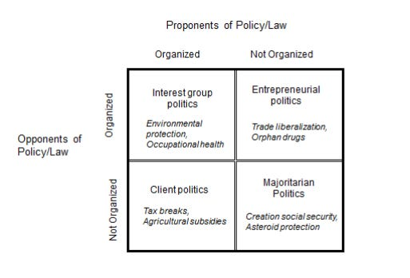

::: {.card-meta}
[Political Thinking]{.badge} [interest-groups]{.badge} [2x2]{.badge}
:::

> Two policies with identical economics can have wildly different political fates. The reason is rarely about ideas. It is about who organises to support, who organises to oppose, and how concentrated the costs and benefits are.

## Origin

The political scientist James Q. Wilson proposed this framework in his 1980 book *The Politics of Regulation*. Wilson was trying to explain a puzzle: why some regulations sailed through despite hurting powerful industries, while others stalled despite broad public support. His answer was a 2×2 matrix built on the *distribution* of costs and benefits.

## What it says

{fig-alt="Wilson's Interest Group Matrix"}

Wilson's matrix sorts every policy by two questions:

- Are its **benefits** concentrated on a small group, or dispersed across many?
- Are its **costs** concentrated on a small group, or dispersed across many?

The four combinations produce four very different politics:

|  | **Costs concentrated** | **Costs dispersed** |
|---|---|---|
| **Benefits concentrated** | **Interest Group Politics** — organised vs. organised. Stalemate or hard bargaining. | **Client Politics** — organised winners, scattered losers. Easiest to pass. |
| **Benefits dispersed** | **Entrepreneurial Politics** — diffuse winners, organised losers. Hardest to pass; needs a champion. | **Majoritarian Politics** — everyone affected, no one strongly. Slow but possible. |

The asymmetry of *organisation* drives outcomes. A small group bearing concentrated costs has every reason to lobby, litigate, and protest. A large group enjoying dispersed benefits has very little reason to do anything at all. Mancur Olson's logic of collective action sits underneath the framework.

## Applied

Two contrasting Indian cases bring the matrix to life.

**Agricultural input subsidies** — fertiliser, electricity, MSP — are a textbook **Client Politics** case. Benefits are concentrated on identifiable producer groups who organise effectively. Costs (fiscal burden, environmental damage, distorted incentives) are dispersed across taxpayers and the broader economy, who do not organise around any single subsidy. Result: subsidies persist across governments and ideologies.

**Privatisation of public sector undertakings** is **Entrepreneurial Politics**. Benefits — better services, fiscal savings, freed-up capital — are dispersed across the population. Costs are highly concentrated on PSU employees, who face job loss and changes in service conditions, and who are well-organised through unions. Even when economic logic clearly favours sale, the politics is asymmetric. That is why privatisation requires a political entrepreneur willing to spend capital on the cause — and why most governments quietly abandon the agenda.

**GST** is closer to **Majoritarian Politics**: everyone gains a little (a unified market, simpler compliance), and everyone loses a little (transition friction, compliance costs). The reform took a decade not because of organised opposition but because the gains were too dispersed to mobilise champions and the costs too dispersed to mobilise opponents. It eventually passed when state governments were brought in as concentrated beneficiaries.

The diagnostic value of the framework: before designing a reform, locate it on the matrix. If you are in the Entrepreneurial quadrant, no amount of economic analysis will substitute for political strategy.

## When it falls short

The matrix treats "concentrated" and "dispersed" as fixed properties. They are not. Skilled reformers can shift a policy across quadrants — by sequencing reforms so the early winners become organised allies, by bundling concentrated losses with concentrated compensation, by changing what counts as the affected group.

It also assumes the relevant actors are interest groups. In contemporary politics, identity, ideology, and media narrative often dominate cost-benefit calculus. A reform that *should* pass on Wilson's logic can fail because it has been coded as an attack on a particular community. A reform that *should* fail can pass because it has been wrapped in a powerful narrative.

Finally, the framework is silent on the **state itself** as an actor. Indian privatisation is not just resisted by employees; it is resisted by parts of the bureaucracy whose reach shrinks when PSUs are sold. The matrix does not see this.

## Related frameworks

- [Confronting Trade-offs](confronting-trade-offs.qmd) — the analytical work that precedes political strategy.
- [The Overton Window](overton-window.qmd) — how the *acceptability* of a reform shifts independently of its cost-benefit politics.
- [Stakeholder Management in Public Policy](stakeholder-management-in-public-policy.qmd) — the practical complement to Wilson's diagnosis.

## Further reading

- Wilson, J. Q. (1980). *The Politics of Regulation*. Basic Books.
- Olson, M. (1965). *The Logic of Collective Action*. Harvard University Press.

::: {.attribution}
Originally explored in [*A Framework a Week: Wilson's Interest Group Matrix*](https://publicpolicy.substack.com/i/221389/a-framework-a-week-wilsons-interest-group-ig-matrix) on *Anticipating the Unintended*.
:::
