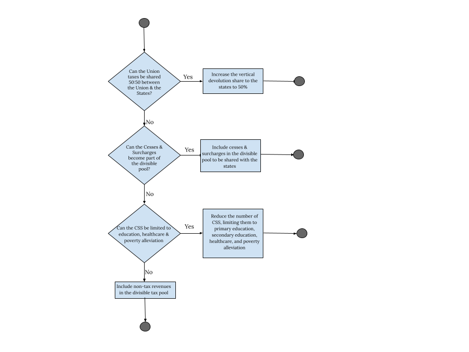

::: {.card-meta}
[Public Finance]{.badge} [federalism]{.badge} [devolution]{.badge}
:::

> The problem is not North vs South but that all Indian states have limited revenue streams for their spending responsibilities.

## Origin

This framework was proposed by Sarthak Pradhan and Pranay Kotasthane in a 2024 article published in *ThePrint*, later explored in the *A Framework a Week* series. It emerged from the political furore over the 2024 Union budget's special grants to Andhra Pradesh and Bihar, which reignited long-standing apprehensions among states about fiscal allocations.

## What it says

{fig-alt="Algorithm for Fiscal Federalism"}

The standard debate on Indian federalism gets stuck on **horizontal devolution** — how to share resources between states. The more important problem is **vertical devolution**: how tax resources are split between the Union government and all states as a whole.

India's Constitution assigns the most buoyant taxes (income tax, corporation tax) to the Union while allocating more spending responsibilities — education, health, police, law and order — to the states. The result is a large and growing **vertical fiscal gap**. The Fifteenth Finance Commission noted that the Union collects 62.7% of combined revenues while states bear 62.4% of total expenditure. States' share in expenditure has risen by around 10 percentage points in the last three decades, but their revenue share has not kept pace.

The framework proposes a decision-tree of solutions, arranged in decreasing order of fiscal benefit to states:

1. **Raise vertical devolution to 50%** — aligning with what the current Prime Minister advocated as Gujarat CM. This would have added ₹2.24 lakh crore to states in FY 2023-24.
2. **Include cesses and surcharges in the divisible pool** — cesses and surcharges (₹5.01 lakh crore in FY 2023-24) are not shared with states. Bringing them in would add ₹2.06 lakh crore.
3. **Reduce Centrally Sponsored Schemes (CSS)** to core areas (education, healthcare, social assistance). CSS distorts state priorities and many states cannot provide matching funds. Limiting CSS would free up ₹1.69 lakh crore.
4. **Include non-tax revenues in the divisible pool** — interest receipts, PSU dividends, and service charges (₹3.01 lakh crore) shared with states would add ₹1.24 lakh crore.

## Applied

The 14th Finance Commission raised states' share from 32% to 42%, but the increase did not translate proportionally into higher devolution because the Union simultaneously expanded cesses and surcharges — a fiscal manoeuvre that kept money out of the divisible pool. This is the vertical-devolution problem in action.

Karnataka's complaint about the 2024 budget, DMK's agitations, and Telangana's protests about biased treatment are all symptoms of the same underlying disease: states have expenditure commitments but lack the revenue instruments to match them. The framework reframes these quarrels from zero-sum interstate rivalries to a shared structural problem.

## When it falls short

The algorithm assumes political feasibility that may not exist. Raising vertical devolution to 50% would require the Union to surrender significant fiscal space, which it is unlikely to do given its own spending obligations — defence, subsidies, and interest payments.

The framework also treats all states as a bloc. In reality, poorer states have weaker absorption capacity and cannot always deploy additional funds effectively. Simply devolving more money does not automatically improve public services if state-level governance and GSDP are low.

Finally, the decision-tree does not address the political economy of specific transfers. Special-category status, discretionary grants, and politically motivated packages (like those to Andhra Pradesh and Bihar) will persist regardless of the devolution formula.

## Related frameworks

- [Three Functions of the State](three-functions-of-the-state.qmd) — the economic logic behind what centre and states spend on.
- [The Domar Rule for Public Debt Sustainability](domar-rule.qmd) — how sustainable borrowing fits into the vertical fiscal gap.
- [Marginal Cost of Public Finance](marginal-cost-of-public-finance.qmd) — the economic cost of every additional rupee raised or spent.
- [Outlays, Outputs, Outcomes](../public-policy/ooo.qmd) — how to evaluate whether transferred funds deliver results.

## Further reading

- Pradhan, S., & Kotasthane, P. (2024). *An Algorithm for Fiscal Federalism*. ThePrint.
- Fifteenth Finance Commission Report, Government of India.
- Rao, M. G., & Singh, N. (2005). *The Political Economy of Federalism in India*. Oxford University Press.

::: {.attribution}
Originally explored in [*A Framework a Week: Algorithm for Fiscal Federalism*](https://publicpolicy.substack.com/i/147695011/india-policy-watch-an-algorithm-for-fiscal-federalism) on *Anticipating the Unintended*.
:::
