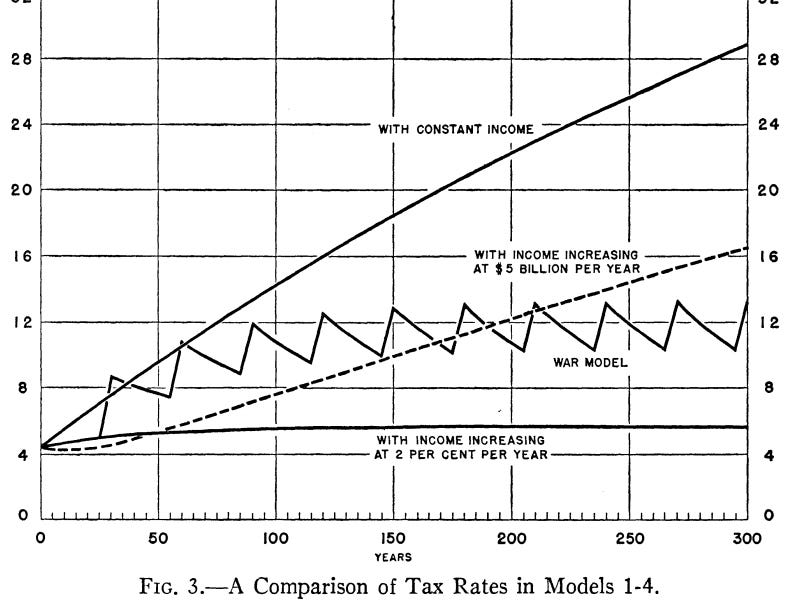

::: {.card-meta}
[Public Finance]{.badge} [debt]{.badge} [macro]{.badge}
:::

> The right question to ask about government debt is not how big it is in absolute terms. It is whether the economy is growing faster than the interest the government pays on its borrowing. If yes, the debt burden shrinks even as it accumulates. If no, it spirals.

## Origin

Evsey Domar laid out the framework in his 1944 paper *[The Burden of the Debt and the National Income](https://www.jstor.org/stable/1807397)*, published in the *American Economic Review*. He was writing in the closing years of World War II, when governments faced enormous post-war reconstruction needs and the political question of whether high public debt would crush future generations was urgent and unsettled.

## What it says

{fig-alt="The Domar Rule for Public Debt Sustainability"}

Domar's insight was deceptively simple. He argued that the conventional fear — that today's deficits force tomorrow's taxpayers into impossibly high tax rates — assumes a static economy. In a *growing* economy, the arithmetic is very different.

The key relationship: as long as the rate of growth of national income (g) exceeds the average interest rate on government debt (r), tax rates needed to service that debt settle to manageable levels and stop rising. The debt-to-GDP ratio stabilises rather than exploding.

The intuition is that compound growth offsets compound interest. A 10% tax rate on an economy that has grown to 120 yields the same revenue as a 12% rate on a stagnant economy of 100. Faster growth means each existing tax instrument generates more rupees, leaving room to service debt without raising rates.

Domar's central conclusion: *"the problem of debt burden is a problem of expanding national income."* Sustainability is a function of growth, not of absolute debt levels.

## Applied

The framework reorients the Indian fiscal debate.

The right diagnostic is the **r minus g** gap, not the headline debt-to-GDP ratio. India's general government debt has hovered around 80% of GDP — a high number by emerging-market standards. But during years when nominal GDP growth has comfortably exceeded the average yield on government bonds, the debt has been on a stable or declining path. During years when growth has collapsed and bond yields have stayed sticky — most starkly during the pandemic year — the same debt level becomes worrying.

The post-2020 moment was a textbook Domar warning. Government bond yields settled around 6.2% while nominal GDP growth had only just turned positive. With r approaching g, the room to borrow for productive public investment — climate infrastructure, human capital, urban transition — narrows sharply. Servicing existing debt eats the fiscal space.

The framework's lesson for Indian fiscal policy: defending growth is the most effective form of debt management. Austerity that crushes growth can worsen the debt position even if it lowers the absolute deficit.

## When it falls short

Domar's rule is a long-run sustainability condition, not a short-run safety guarantee. An economy can satisfy *r < g* on average and still face a debt crisis if creditors lose confidence and refuse to roll over short-term debt. Confidence is fragile in ways the formula does not capture.

The framework also assumes the government can borrow at the going rate. For sub-sovereigns (Indian state governments), municipal bodies, and public sector undertakings, the relevant interest rate is much higher and confidence-sensitive. Their Domar arithmetic is far more punishing.

Finally, the framework is silent on the **composition** of debt. Borrowing for capital investment that lifts long-run growth is qualitatively different from borrowing for subsidies that do not. Domar treats every rupee of debt the same. Real fiscal analysis must look inside the deficit.

## Related frameworks

- [Marginal Cost of Public Finance](marginal-cost-of-public-finance.qmd) — the broader cost of every additional rupee government raises or spends.
- [Three Functions of the State](three-functions-of-the-state.qmd) — what governments are spending the borrowed money on.
- [Algorithm for Fiscal Federalism](algorithm-for-fiscal-federalism.qmd) — how debt and revenue should be split between centre and states.

## Further reading

- Domar, E. (1944). *The Burden of the Debt and the National Income*. American Economic Review, 34(4), 798–827.
- Reserve Bank of India, *State Finances: A Study of Budgets*, annual.
- Martin Feldstein's *L K Jha Memorial Lecture* offers a different [view](https://rbidocs.rbi.org.in/rdocs/Publications/PDFs/50483.pdf).
  
::: {.attribution}
Originally explored in [*A Framework a Week: The Domar Rule*](https://publicpolicy.substack.com/i/33343975/a-framework-a-week-the-domar-rule-for-public-debt-sustainability) on *Anticipating the Unintended*.
:::
