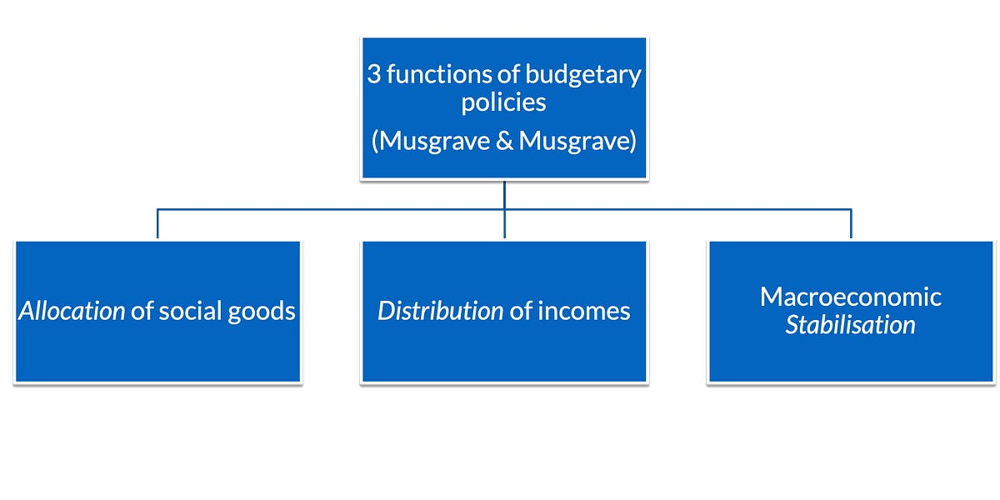

::: {.card-meta}
[Public Finance]{.badge} [public-finance]{.badge} [taxonomy]{.badge}
:::

> Most arguments about what the government should do are confused, because the participants are talking about different functions of the state without realising it. Sorting them apart is the first move of clear public-finance thinking.

## Origin

The taxonomy was set out by Richard Musgrave (and later, jointly with Peggy Musgrave) in *The Theory of Public Finance* (1959) and the textbook *Public Finance in Theory and Practice* (1973, with several later editions). The three-function distinction has become the standard organising frame for the field of public finance.

## What it says

{fig-alt="Three Functions of the State"}

Government's economic role splits into three distinct functions, each with its own logic, its own instruments, and its own measure of success.

**Allocation.** The state provides goods and services that markets, left alone, would underprovide. Public goods (street lighting, clean air, national defence) are non-rival and non-excludable; if everyone can free-ride, no private firm will produce enough of them. The state steps in, funds provision through compulsory taxation, and corrects the market failure.

**Distribution.** The state alters the distribution of income and wealth produced by markets, to bring it closer to society's view of fairness. Three instruments do most of the work: progressive taxation paired with cash transfers; progressive taxation funding services consumed disproportionately by lower-income households (public health, school education); and differential commodity taxation (zero GST on grain, 28% on luxury cars).

**Stabilisation.** The state manages the macroeconomy — aiming for low and stable inflation, full employment, and steady growth. The instruments are monetary (interest rates set by the central bank) and fiscal (cyclical adjustment of capital spending, automatic stabilisers like MGNREGS, counter-cyclical borrowing).

The functions are conceptually distinct but politically and economically entangled. **A budgetary policy designed for one function can cause problems in another.** Subsidies designed for distribution can distort allocation. A monetary tightening for stabilisation can hit redistributive transfers. Good public-finance design is, in large part, the work of minimising these conflicts.

## Applied

Indian fuel subsidies are a textbook case of function-confusion.

The original justification was *distributional* — keep cooking gas, kerosene, and diesel affordable for poor households. But the chosen instrument was a price subsidy, which changes the *allocation* of the underlying resource (more fuel consumed than is efficient, environmental costs ignored, price signals broken across the economy). Meanwhile the same subsidy ate into fiscal space needed for *stabilisation*, particularly in years when oil prices spiked. One policy compromised on all three functions.

The slow-motion fix — direct benefit transfers (DBT) to LPG users — illustrates the framework's prescriptive payoff. DBT separates the functions cleanly: the cash transfer handles distribution; market prices handle allocation; predictable budgeting helps stabilisation. The same total redistributive effect, with far less collateral damage. Whatever else one thinks of the LPG subsidy reform, it was a public-finance design improvement.

The framework's diagnostic power: when something feels wrong with a tax, subsidy, or scheme, ask which function it was meant to serve and which functions it is actually affecting. Most policy mistakes are functions colliding inside a single instrument.

## When it falls short

Musgrave's three functions are an *economic* taxonomy. Real states do many things that fit awkwardly into the scheme: industrial policy, national identity-building, security, the cultivation of strategic capabilities. A purely Musgravian view of the state can underplay these.

The taxonomy also assumes a fairly capable state that knows what it is doing. In contexts of weak state capacity, the more pressing question is not "which function should this instrument serve?" but "can the state actually deliver any of these functions?"

Finally, the boundaries between the functions are softer in practice than in textbooks. Universal public health serves allocation, distribution, *and* stabilisation simultaneously. Insisting on clean separation can blind designers to interventions that are valuable precisely because they work across functions.

## Related frameworks

- [Marginal Cost of Public Finance](marginal-cost-of-public-finance.qmd) — the economic cost of every rupee government raises to fund any of these functions.
- [Outlays, Outputs, Outcomes](../public-policy/ooo.qmd) — how to evaluate spending against whichever function it was meant to serve.
- [Algorithm for Fiscal Federalism](algorithm-for-fiscal-federalism.qmd) — how the three functions get split between centre and states.

## Further reading

- Musgrave, R. A., & Musgrave, P. B. (1973). *Public Finance in Theory and Practice*. McGraw-Hill.
- Stiglitz, J. E., & Rosengard, J. K. (2015). *Economics of the Public Sector*. W. W. Norton.

::: {.attribution}
Originally explored in [*A Framework a Week: Three Functions of the State*](https://publicpolicy.substack.com/i/32033945/a-framework-a-week-three-functions-of-the-state) on *Anticipating the Unintended*.
:::
