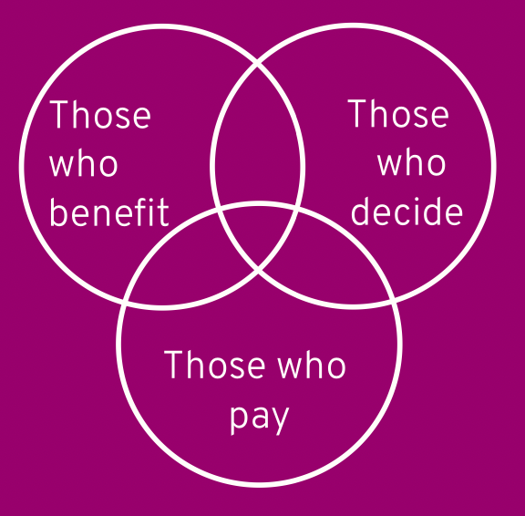

::: {.card-meta}
[Public Finance]{.badge} [local-government]{.badge} [accountability]{.badge}
:::

> In most Indian cities, there is almost no coincidence between the three circles of budgetary policy: those who decide, those who benefit, and those who pay.

## Origin

The concept was proposed by the Swedish economist Knut Wicksell more than a century ago. The term **Wicksellian Connection** was coined by Albert Breton to describe the ideal linkage between taxes paid and services received. The inverse — the **Wicksellian Disconnection** — describes what happens when that linkage breaks down. Economists Richard Bird and Enid Slack applied the idea specifically to local government finance in developing countries.

## What it says

{fig-alt="Wicksellian Disconnection"}

The core intuition is simple: when people pay for a service, they care about its quality; when they receive a service they helped fund, they use it responsibly. The **Wicksellian Connection** is the clear linkage between expenditure and revenue decisions. When it is intact, accountability is built into the fiscal system.

In India, the connection is almost entirely severed. Most taxes are collected by the Union and state governments, while spending decisions for local services — roads, water, sanitation, street lighting — are supposed to be carried out by local governments. The result is a system where:
- **Those who decide** (local bodies) lack the revenue to implement decisions.
- **Those who pay** (citizens and businesses) pay taxes to distant governments and see no link to local services.
- **Those who benefit** (local residents) consume services without bearing the marginal cost.

You are left wondering why the street outside your house remains broken even though your tax burden rises every year. The answer is that your taxes did not fund the street; they vanished into a general pool controlled by someone else.

Bird and Slack propose three measures to restore the connection:
1. **User charges** wherever possible — they provide both revenue and information about which services are valued.
2. **Value-based property taxes** for services where user charges are impractical (roads, transit, recreation), linking payment to local benefit through property values.
3. **Local budgeting autonomy** — local governments must have real freedom to set revenue levels and bear the consequences of their decisions.

## Applied

Indian urban governance is a textbook case of Wicksellian disconnection. Municipal corporations in most states cannot levy meaningful taxes. Property tax collection is abysmal. User charges for water and sewerage cover a fraction of operating costs. Meanwhile, state governments control municipal cadres, approve projects, and divert funds. Citizens pay state and central taxes but have no leverage over local service quality.

The contrast with well-functioning urban local bodies — such as Surat or some Kerala municipalities — is instructive. Where local governments have revenue autonomy and political accountability, service delivery improves. Where they are fiscally dependent on state transfers, garbage piles up, water runs short, and roads crumble.

The framework also explains the political economy of freebies. When the three circles are disconnected, state and Union governments can promise free electricity, free water, or loan waivers without bearing the local fiscal cost. The beneficiaries do not pay; the payers do not decide. It is a formula for fiscal irresponsibility.

## When it falls short

The Wicksellian framework assumes local governments have the capacity to collect taxes, maintain accounts, and respond to citizen feedback. In much of rural India and in smaller urban bodies, this capacity is absent. Imposing user charges without collection infrastructure merely creates new opportunities for rent-seeking.

The framework can also be too rigid about localisation. Some public goods — national highways, defence, epidemic control — are inherently non-local, and the connection between local taxes and local benefits is appropriately weak. Not every service should be financed locally.

Finally, the political economy of recentralisation is powerful. State governments resist empowering municipalities because local power bases threaten their own dominance. The Wicksellian prescription is correct in theory but politically difficult because it requires those currently in control to voluntarily surrender fiscal authority.

## Related frameworks

- [Algorithm for Fiscal Federalism](algorithm-for-fiscal-federalism.qmd) — how revenue and spending responsibilities are split across levels of government.
- [India's Three Dimensions of Decentralisation](../public-policy/indias-three-dimensions-of-decentralisation.qmd) — capacity and governance constraints that prevent local fiscal autonomy from working.
- [Three Functions of the State](three-functions-of-the-state.qmd) — the economic logic of what different levels of government should provide.

## Further reading

- Wicksell, K. (1896). *A New Principle of Just Taxation*. In Musgrave, R. A., & Peacock, A. T. (Eds.), *Classics in the Theory of Public Finance* (1958).

::: {.attribution}
Originally explored in [*A Framework a Week: Wicksellian Disconnection*](https://publicpolicy.substack.com) on *Anticipating the Unintended*.
:::
