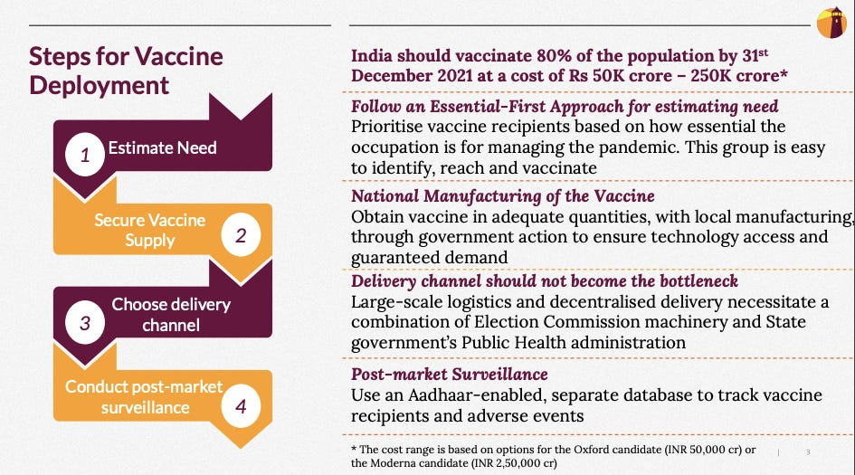

::: {.card-meta}
[Public Policy]{.badge} [implementation]{.badge} [state-capacity]{.badge}
:::

> Vaccinating 100 crore people is a problem thirty times bigger than what India's Universal Immunisation Programme manages annually. The sequencing problem is non-trivial for a country of India's size and income levels.

## Origin

The framework was developed by Shambhavi Naik and colleagues at the Takshashila Institution in a September 2020 Discussion SlideDoc. Pranay Kotasthane featured it in the *Anticipating the Unintended* newsletter as a case study in operationalising policy under extreme scale and time pressure.

## What it says

{fig-alt="A COVID-19 Vaccine Deployment Strategy for India"}

The framework breaks vaccine deployment into four interconnected challenges:

**Estimate need.** Prioritise a small set of essential-service recipients first, then use randomisation rather than fine-grained demographic sequencing for the mass rollout. Randomisation is simpler, faster, and fairer than age or comorbidity-based queues at scale.

**Secure supply.** At prevailing production capacity, vaccinating 80% of the population would take 20 months. India therefore needs diversified sourcing, technology transfer agreements, and manufacturing partnerships backed by transparent model contracts.

**Choose delivery channel.** Leverage the Election Commission of India's booth infrastructure for mission-mode coverage, coordinated through state public health machinery.

**Track distribution.** Build a separate database — using Aadhaar and/or election ink as identifiers — to monitor vaccine flow and adverse events in real time.

The underlying principle is **modular problem decomposition**: break an overwhelming logistical challenge into separable workstreams, each with its own metrics, accountability, and fallback.

## Applied

- When scaling any public health intervention from pilot to population — TB screening, deworming, micronutrient supplementation.
- When sourcing critical goods under supply constraint: diversify suppliers, publish contracts, and build domestic manufacturing options.
- When designing last-mile delivery for programmes that must reach every village within a compressed window.

## When it falls short

The framework was designed for a specific pandemic moment; some elements — such as randomisation over sequencing — were appropriate for speed but may not suit interventions where targeting is ethically or medically paramount. It also assumes state machinery can be repurposed rapidly; in contexts where Election Commission or health administration capacity is compromised, the delivery channel choice collapses.

## Related frameworks

- [[Seven Stages of the Policy Pipeline]](../public-policy/seven-stages-policy-pipeline.qmd) — the upstream capacity prerequisites for implementation at this scale.
- [[Outlays, Outputs, Outcomes]](../public-policy/ooo.qmd) — how to track whether deployment actually reduced transmission or mortality.
- [[Wicked Problems]](../public-policy/wicked-problems.qmd) — when the crisis itself is evolving faster than any plan can adapt.

## Further reading

- Naik, S., et al. (2020). *A COVID-19 Vaccine Deployment Strategy for India*. Takshashila Discussion SlideDoc.
- [Original newsletter essay](https://publicpolicy.substack.com/p/68-a-sin-called-consumption-)

::: {.attribution}
Originally explored in [*A Framework a Week: A COVID-19 Vaccine Deployment Strategy for India*](https://publicpolicy.substack.com/p/68-a-sin-called-consumption-) on *Anticipating the Unintended*.
:::
