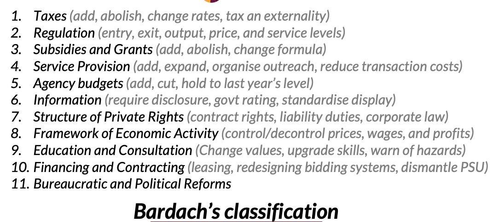

::: {.card-meta}
[Public Policy]{.badge} [state-capacity]{.badge} [institutional-design]{.badge}
:::

> Whenever we consider government intervention, it is always useful to know the entire range of options available — a toolkit of sorts. Given any policy problem, one should be able to go through this toolkit and ask: might this be a better way to solve this problem?

## Origin

This framework draws on three sources. Vijay Kelkar and Ajay Shah, in their 2019 book *In Service of the Republic*, propose three pillars of state intervention: the government might **produce** a service, **regulate** private providers, or **finance** private consumption. Eugene Bardach’s *A Practical Guide for Policy Analysis* offers a second classification. A third — eight categories taught at the Takshashila Institution — rounds out the toolkit.

## What it says

{fig-alt="All Things Governments Do"}

**The three-pillar view** maps interventions to market failures: positive externalities justify financing; negative externalities, asymmetric information, or market power justify regulating; and direct production is the fallback when neither suffices.

**The eight-category toolkit** is more granular:

1. **Do nothing**
2. **Engage in rhetoric** — shape norms and narratives without coercion
3. **Nudge** — alter choice architecture without banning or mandating
4. **Umpire** — enforce contracts and resolve disputes
5. **Marginally change incentives** — taxes, subsidies, fines
6. **Drastically change incentives** — free provision, bans, quotas
7. **Do it yourself** — direct state production
8. **Change ownership** — nationalisation or divestment

The discipline is to run through the list before defaulting to the most heavy-handed option. Each step up the ladder demands more state capacity and risks more unintended consequences.

## Applied

India’s LPG subsidy reform moved the state from category 7 (direct production and distribution) to category 5 (financing private purchase via direct benefit transfer). The DGCA regulates private airlines (category 4), while state transport corporations still produce bus services (category 7).

The framework explains why rhetoric (category 2) is overused in India: it is cheap and capacity-light. It also explains why bans (category 6) are popular but often backfire — from alcohol prohibition to pornography blocks — because the state lacks the enforcement capacity that drastic incentives require.

## When it falls short

Real policies often blend categories. The Production-Linked Incentive (PLI) scheme is part finance (category 5), part rhetoric (category 2), and part industrial policy (category 7). The taxonomy is a heuristic, not a decision rule. It also does not tell you *which* market failure justifies intervention — only what tools are available once you have diagnosed one.

## Related frameworks

- [Four Components of an Economic Strategy](four-components-of-an-economic-strategy.qmd) — how the taxonomy maps to slogans, targets, programmes, and policies.
- [Policies vs Programmes vs Practices](policies-vs-programmes-vs-practices.qmd) — the granularity at which these tools actually operate on the ground.
- [One Instrument, One Target](one-instrument-one-target.qmd) — why mixing too many of these tools on one instrument produces failure.

## Further reading

- Kelkar, V., & Shah, A. (2019). *In Service of the Republic: The Art and Science of Economic Policy*. Penguin Allen Lane.
- Bardach, E. *A Practical Guide for Policy Analysis*.

::: {.attribution}
Originally explored in [*A Framework a Week: Things Governments Do*](https://publicpolicy.substack.com/i/266338/a-framework-a-week-things-governments-do) on *Anticipating the Unintended*.
:::
