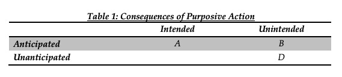

::: {.card-meta}
[Public Policy]{.badge} [policy-design]{.badge} [foresight]{.badge}
:::

> Not every consequence of a policy that is unintended is also unanticipated. The intention was good after all — think demonetisation and the reasons that were used to justify it.

## Origin

The framework comes from Frank de Zwart’s work on unintended consequences, adapted for policy analysis in the *Anticipating the Unintended* newsletter. The core insight is conceptual: the words "unintended" and "unanticipated" are not synonyms, and conflating them lets policymakers off the hook.

## What it says

{fig-alt="Anticipating Unintended Policy Consequences"}

De Zwart proposes a 2 × 2 matrix:

| | **Anticipated** | **Unanticipated** |
|---|---|---|
| **Intended** | (A) Rational ideal — purposive action realises intentions | *Empty cell* |
| **Unintended** | (B) Unintended but foreseen — the policy danger zone | (D) Unexpected outcomes — the social-science classic |

The empty top-right cell is logical: what is intended cannot be unanticipated, and vice versa. The traditional focus of policy analysis has been on cell A (did it work?) and cell D (what surprised us?). This framework directs attention to **cell B**: consequences that are unintended but could have been foreseen had the designer thought harder.

The key move is analytical. Experience, economic reasoning, and an understanding of local context can shift many consequences from D to B. The next time someone proposes a price cap on movie tickets, you can anticipate the unintended consequence in advance: popcorn and complementary goods will become costlier as sellers recoup revenue elsewhere.

## Applied

India’s demonetisation was defended by pointing to unintended consequences — cash shortages, informal-sector distress — as if their unintended nature made them unanticipatable. But a basic understanding of liquidity and India’s cash-dependent economy would have placed many of these effects squarely in cell B.

The odd-even vehicle scheme in Delhi is another example. Its intended effect was lower pollution; an unintended but anticipated consequence was that households with means would buy a second car to game the system. That shift is predictable and should have been priced into the design.

## When it falls short

The framework cannot tell you *which* consequences are anticipatable in advance. That requires domain expertise and imagination. Worse, it can breed overconfidence: analysts may claim that every failure "should have been anticipated," which is unfair to decision-makers operating under genuine uncertainty. The line between B and D is contested, not clean.

## Related frameworks

- [Complexity and Public Policy](complexity-and-public-policy.qmd) — why some consequences are genuinely unanticipatable because the system is complex.
- [Wicked Problems](wicked-problems.qmd) — problems where we cannot agree on what counts as a consequence, let alone whether it was foreseen.
- [Taxonomy of Policy Failures and Successes](taxonomy-of-policy-failures-and-successes.qmd) — a meta-framework for diagnosing where in the chain things went wrong.

::: {.attribution}
Originally explored in [*A Framework a Week*](https://publicpolicy.substack.com/i/157063/a-framework-a-week) on *Anticipating the Unintended*.
:::
