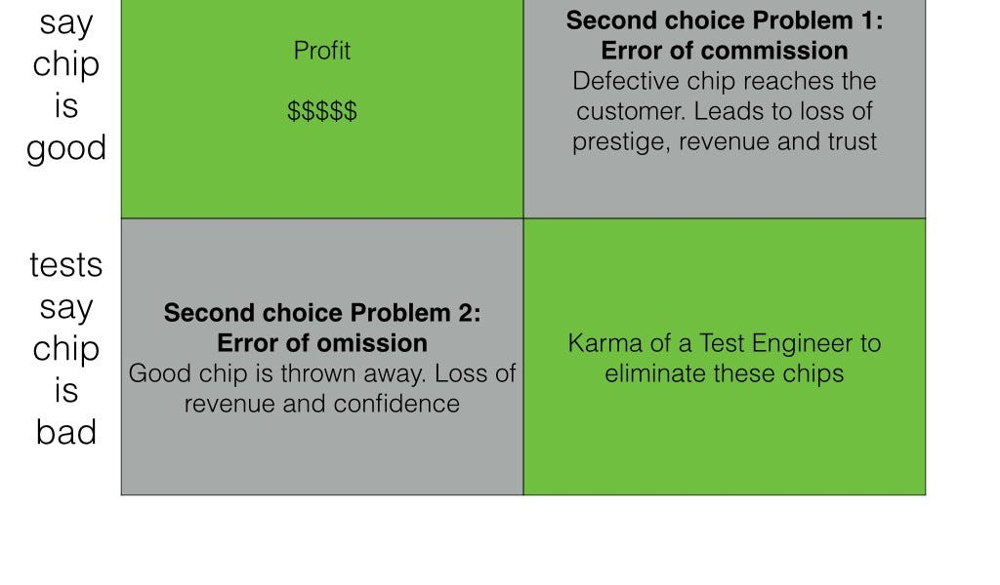

::: {.card-meta}
[Public Policy]{.badge} [targeting]{.badge} [evaluation]{.badge}
:::

> The art of policymaking lies in picking a second-best option that makes most people better off. Thinking about second choices is generally useful in public policy as the first-choice option is often unavailable.

## Origin

The framework borrows from "design-for-testability" theory in integrated-circuit (VLSI) manufacturing, where every chip is tested before it reaches the consumer. The analogy was introduced to public policy in *Anticipating the Unintended* and applied to subsidy targeting.

## What it says

{fig-alt="Errors of Omission and Commission"}

In chip testing, four scenarios arise:

| | **Test says GOOD** | **Test says BAD** |
|---|---|---|
| **Chip is actually GOOD** | Ideal | **Error of Omission** — good chip discarded |
| **Chip is actually BAD** | **Error of Commission** — bad chip shipped | Ideal |

Translating this to subsidy design:

- **Error of Commission (inclusion error):** A non-needy beneficiary receives the subsidy. Free-riders sideline the truly needy; fiscal costs balloon.
- **Error of Omission (exclusion error):** A needy person is denied the subsidy. The most vulnerable are left out.

The tolerable error depends on context. For mission-critical automobile braking systems, omission is preferable — safety first. For low-end consumer goods, commission may be acceptable to keep costs down.

## Applied

Most Indian subsidies start wide and tolerate high commission errors: the public distribution system, fertiliser subsidies, and electricity subsidies all include large numbers of non-poor beneficiaries. Aadhaar-linked direct benefit transfers were designed precisely to shrink the commission error — to stop the bad chips from getting through.

The choice is politically loaded. A subsidy with high omission errors produces visible, sympathetic victims (denied rations, excluded widows), while commission errors produce diffuse, invisible waste. Politicians therefore bias toward inclusion, even when exclusion would be more efficient.

## When it falls short

The binary framing oversimplifies real policy. Beneficiaries are not simply "needy" or "not needy" — need is continuous, not categorical. The framework also treats the test itself as neutral, when in reality the eligibility criteria are politically constructed. Who designs the test shapes which error dominates.

## Related frameworks

- [Opportunity Cost Neglect](opportunity-cost-neglect.qmd) — what we miss when we judge a scheme only by its own error rate.
- [Outlays, Outputs, Outcomes](ooo.qmd) — the chain in which targeting errors propagate.
- [Taxonomy of Policy Failures and Successes](taxonomy-of-policy-failures-and-successes.qmd) — how to diagnose whether an error is design failure or implementation failure.

::: {.attribution}
Originally explored in [*A Framework a Week: Errors of Omission and Commission*](https://publicpolicy.substack.com/i/54857006/a-framework-a-week-errors-of-omission-and-commission-how-vlsi-relates-to-subsidies) on *Anticipating the Unintended*.
:::
