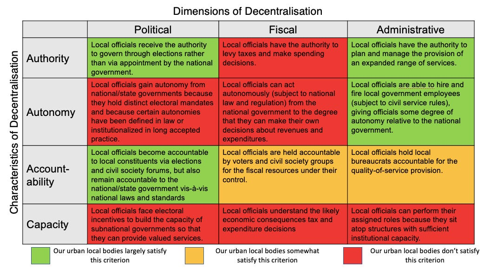

::: {.card-meta}
[Public Policy]{.badge} [federalism]{.badge} [urban-governance]{.badge}
:::

> At the heart of state-building is a fiscal story. It is not unexpected that the sorry state of fiscal decentralisation is a powerful reason behind the abject failure of our urban governments.

## Origin

The framework combines three sources: the USAID Democratic Decentralisation Programming Handbook, which maps three dimensions of decentralisation against four governance characteristics; Albert Breton’s theory of competitive federalism; and Devesh Kapur’s insight that state-building is fundamentally fiscal.

## What it says

{fig-alt="India's Three Dimensions of Decentralisation"}

Decentralisation takes three forms:

- **Deconcentration** — dispersing functions geographically while retaining central control. Passport seva kendras are deconcentrated.
- **Delegation** — assigning functions to a subordinate body that remains accountable upward. State public sector enterprises for power and water are delegated.
- **Devolution** — transferring autonomous authority to a lower level. Indian states are devolved units; urban local bodies, despite the 74th Amendment, largely are not.

Decentralisation also operates along three dimensions, each measured by four factors (authority, autonomy, accountability, capacity):

| Dimension | What it means |
|---|---|
| **Political** | Elected local governments with real power |
| **Administrative** | Local control over personnel and service delivery |
| **Fiscal** | Local revenue-raising and spending authority |

India’s diagnosis: the Union–State relationship is characterised by devolution; the State–local relationship is characterised by delegation and deconcentration. Urban governments score adequately on administrative decentralisation, poorly on political decentralisation, and **near-zero on fiscal decentralisation.**

## Applied

Bengaluru’s chronic flooding is not merely an engineering failure; it is a governance failure rooted in fiscal orphanhood. The city cannot raise adequate revenue, state governments control its purse strings, and State Finance Commissions are weak compared to their Union counterparts.

The path forward requires focusing on the fiscal dimension: "Wherever possible, charge" to generate non-tax revenue; strengthen State Finance Commissions; rent out municipal property; simplify business regulation to raise trade-license fees; and capitalise on property tax potential.

## When it falls short

Decentralisation is not always efficient. Local governments can be captured by local elites. Capacity constraints are real — a fiscally devolved but incompetent municipality may perform worse than a deconcentrated but professional state agency. And competitive federalism, without guardrails, can produce a race to the bottom on subsidies and tax breaks rather than a race to the top on governance.

## Related frameworks

- [Public Sector Reform](public-sector-reform.qmd) — separating steering and rowing as a precondition for meaningful decentralisation.
- [When Conditions Become Policy Problems](when-conditions-become-policy-problems.qmd) — why urban governance has not yet been defined as a pressing problem.
- [Complexity and Public Policy](complexity-and-public-policy.qmd) — the case for local experimentation in complex systems.

## Further reading

- USAID. *Democratic Decentralisation Programming Handbook*.

::: {.attribution}
Originally explored in [*A Framework a Week: The Anatomy of Decentralisation*](https://publicpolicy.substack.com/i/73591188/india-policy-watch-the-anatomy-of-decentralisation) on *Anticipating the Unintended*.
:::
