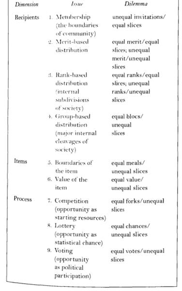

::: {.card-meta}
[Public Policy]{.badge} [distributive-justice]{.badge} [political-economy]{.badge}
:::

> It is easy to say that inequality is a problem. It is far more difficult to answer what being equal means.

## Origin

The framework comes from Deborah Stone’s classic *Policy Paradox: The Art of Political Decision Making*. Stone argues that "equality often means inequality, and equal treatment often means unequal treatment. The same distribution may look equal or unequal, depending on where you focus."

## What it says

{fig-alt="Nine Competing Visions of Equality"}

Stone identifies nine ways to distribute a resource equitably, split across three dimensions:

**Who gets something?**
1. **Membership** — equal slices among all members of a defined group. Citizenship is a membership criterion; it excludes non-citizens by design.
2. **Merit** — the more deserving get more. Rewards accomplishment or aptitude.
3. **Rank** — equally ranked get equal pay; unequally ranked get unequal payouts.

**What gets distributed?**
4. **Group-based** — distribution according to subgroup identity. Caste-based reservation is an example.
5. **Expanding boundaries** — redefining the item being distributed. Cash plus food, rather than cash alone.
6. **Value ascribed** — distribution according to how much recipients value the item.

**How is the distribution done?**
7. **Fair competition** — winners take more, but the process was open.
8. **Lottery** — equalising chances, not outcomes.
9. **Vote** — democratic decision on who gets what.

Each vision equalises along one dimension while creating inequality along another. There is no single "fairest" method — only methods that are more or less appropriate to the context.

## Applied

If the Indian government plans to distribute ₹50,000 crores to 50 crore Indians, the intuitively obvious solution — ₹1,000 each — is only one of nine visions. It equalises membership (Way 1) but is unequal on merit, need, and group disadvantage. Caste reservations equalise group-based access (Way 4) but create unequal treatment of individuals within the same economic bracket.

Policymakers often default to Way 1 (equal slices) or Way 8 (lottery) when they cannot find better reasons to justify a decision. A disciplined analyst, faced with a distributive problem, should run through all nine before picking the one that best fits the moral and political context.

## When it falls short

The framework is descriptive, not prescriptive. It does not tell you which vision to choose — that requires a theory of justice. In practice, political coalitions pick the vision that advantages their base and then dress it up in the language of fairness. The framework can also paralyse decision-making: if every distribution is unequal in some dimension, every distribution is contestable.

## Related frameworks

- [Opportunity Cost Neglect](opportunity-cost-neglect.qmd) — what we miss when we debate distribution without asking what the same resources could have achieved elsewhere.
- [Errors of Omission and Commission](errors-of-omission-and-commission.qmd) — the targeting errors that arise when we operationalise any vision of equality.
- [Wicked Problems](wicked-problems.qmd) — distributive justice is wicked because stakeholders disagree on which of the nine visions should prevail.

## Further reading

- Stone, D. *Policy Paradox: The Art of Political Decision Making*.

::: {.attribution}
Originally explored in [*A Framework a Week: Nine Competing Visions of Equality*](https://publicpolicy.substack.com/i/4452439/a-framework-a-week-nine-competing-visions-of-equality) on *Anticipating the Unintended*.
:::
