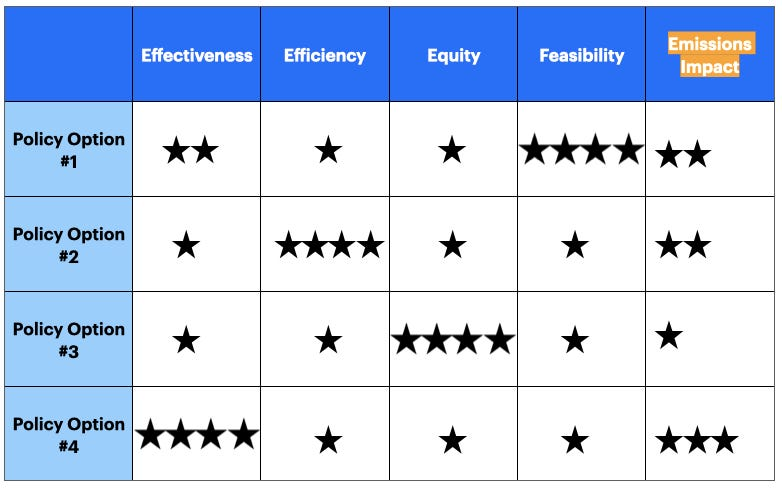

::: {.card-meta}
[Public Policy]{.badge} [evaluation]{.badge} [climate]{.badge}
:::

> Emissions impact is no longer a vertical issue for polluting sectors alone. It is now a horizontal concern across every policy sector — and it must be weighed alongside effectiveness, efficiency, equity, and feasibility.

## Origin

The framework extends Eugene Bardach's *Eightfold Path to Policy Analysis*, a staple of policy design courses. Pranay Kotasthane explored the addition of a fifth criterion — emissions impact — in the *Anticipating the Unintended* newsletter, arguing that India's COP26 commitments have updated the Bayesian priors of policy evaluation.

## What it says

{fig-alt="No More COP-outs"}

Bardach's four canonical criteria for judging policy options are effectiveness, efficiency, equity, and feasibility. Confronting trade-offs across them is already difficult — no solution optimises all four. But India's international climate commitments add a fifth: **emissions impact**.

The framework's core claim is that emissions can no longer be treated as a specialised concern for environment ministries. It is now a cross-cutting evaluation parameter that must sit alongside the other four in every sector — agriculture, energy, transport, urban planning. The weight given to it may vary by context, but ignoring it is a cop-out.

Two pitfalls follow. One is unthinking transplantation of Western solutions — degrowth narratives, Malthusian population rhetoric — onto a country still raising incomes. The other is cynical fatalism: the claim that climate action is futile, which becomes a self-fulfilling prophecy.

## Applied

- When comparing infrastructure projects where the cheapest option also has the highest carbon footprint.
- When evaluating agricultural subsidies that raise yields but increase methane or fertiliser emissions.
- When designing urban mobility schemes where equity (access for the poor) and emissions (clean vehicles) pull in different directions.

## When it falls short

The fifth criterion adds complexity to an already contested trade-off space. Analysts may use it to justify pre-existing preferences rather than to discipline them. It also risks treating emissions as a scalar when the relevant metric — local pollution, global warming potential, adaptation resilience — varies enormously by sector.

## Related frameworks

- [[One Instrument, One Target]](../public-policy/one-instrument-one-target.qmd) — why stacking multiple goals onto one instrument undermines all of them.
- [[Confronting Trade-offs]](../political-thinking/confronting-trade-offs.qmd) — how to reason when no option dominates on every criterion.
- [[Wicked Problems]](../public-policy/wicked-problems.qmd) — when even defining the problem is contested.

## Further reading

- Bardach, E. *A Practical Guide for Policy Analysis*. CQ Press.
- [Original newsletter essay](https://publicpolicy.substack.com/p/146-woke-up-on-the-right-side)

::: {.attribution}
Originally explored in [*A Framework a Week: No More COP-outs*](https://publicpolicy.substack.com/p/146-woke-up-on-the-right-side) on *Anticipating the Unintended*.
:::
