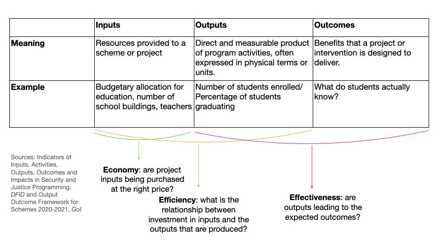

::: {.card-meta}
[Public Policy]{.badge} [evaluation]{.badge} [theory-of-change]{.badge}
:::

> Most government schemes are debated as if money spent equals success. The OOO framework forces a longer chain of reasoning: from rupees to activity, and from activity to actual change in people's lives.

## Origin

The Outlays–Outputs–Outcomes distinction comes from the public administration and programme evaluation tradition, formalised in tools like the *logical framework approach* used by international development agencies from the 1970s onwards. In India, the framework is built into the Union Budget through the *Output–Outcome Framework for Schemes*, published annually alongside the budget documents since 2017–18.

## What it says

{fig-alt="Outlays, Outputs, Outcomes"}

The framework chains three categories of measurement:

- **Outlays (or Inputs):** the resources put into a scheme — money, staff, materials. *Did we spend the budget?*
- **Outputs:** the direct, countable products of the activity. *How many schools were built? How many vaccinations were administered?*
- **Outcomes:** the change in the world that the scheme was meant to produce. *Did learning levels rise? Did disease incidence fall?*

The relationship between the three is what evaluators call a **theory of change**: a chain of assumptions linking spending → activity → impact. The chain can break at any link.

```{mermaid}
flowchart LR
  A["**Outlays**\nMoney, staff,\nmaterials"] -->|"Theory\nof change"| B["**Outputs**\nSchools built,\nvaccinations given"]
  B -->|"Theory\nof change"| C["**Outcomes**\nLearning rises,\ndisease falls"]
  style A fill:#eef1f6,stroke:#1a4480,color:#1a1a1a
  style B fill:#eef1f6,stroke:#1a4480,color:#1a1a1a
  style C fill:#eef1f6,stroke:#1a4480,color:#1a1a1a
```

A useful diagnostic vocabulary follows from the chain:

- **Economy** asks whether outlays were procured at the right price.
- **Efficiency** asks how outputs relate to outlays — output per rupee.
- **Effectiveness** asks how outcomes relate to outputs — whether the activity actually moved the needle.

A scheme can be efficient but ineffective: lots of cheap activity that changes nothing.

## Applied

Indian education is the textbook case. For decades, the policy conversation tracked outlays (money for *Sarva Shiksha Abhiyan*) and outputs (schools built, teachers hired, children enrolled). On those metrics, the system was a clear success — enrolment crossed 95%.

Then learning assessments arrived, and outcomes came into view. ASER and NAS data showed that the average class 5 student could not read a class 2 textbook. As the economist Ajay Shah put it, very large increases in per-pupil expenditure produced essentially no gains in measured outcomes. That was not an implementation failure; it was a theory-of-change failure. The implicit assumption — that more inputs and outputs would automatically yield outcomes — was wrong.

The framework's value is to make that assumption *visible*, so it can be examined and tested rather than smuggled into every budget speech.

## When it falls short

Outcomes are slow, contested, and often hard to attribute. A learning gain in 2030 is shaped by curriculum reforms in 2024, teacher hiring in 2018, and parental income trends across the decade. Demanding outcome accountability from any one scheme can punish the schemes that are best designed but slowest to show results.

The framework is also vulnerable to the **measurable crowding out the meaningful**. Outcomes that can be cheaply counted (test scores, vaccination rates) get treated as the whole story, while harder-to-measure outcomes (curiosity, civic capability, health-seeking behaviour) drop out of the conversation.

## Related frameworks

- [Errors of Omission and Commission](errors-of-omission-and-commission.qmd) — the symmetric mistakes a budget can make.
- [Opportunity Cost Neglect](opportunity-cost-neglect.qmd) — what we miss when we judge a scheme only by its own outcomes.
- [Marginal Cost of Public Finance](../public-finance/marginal-cost-of-public-finance.qmd) — what every rupee of outlay actually costs the economy.

## Further reading

- Government of India, *Output Outcome Framework for Schemes*, published annually with the Union Budget. [indiabudget.gov.in](https://www.indiabudget.gov.in)

::: {.attribution}
Originally explored in [*A Framework a Week: OOO*](https://publicpolicy.substack.com/i/31170838/a-framework-a-week-ooo) on *Anticipating the Unintended*.
:::
