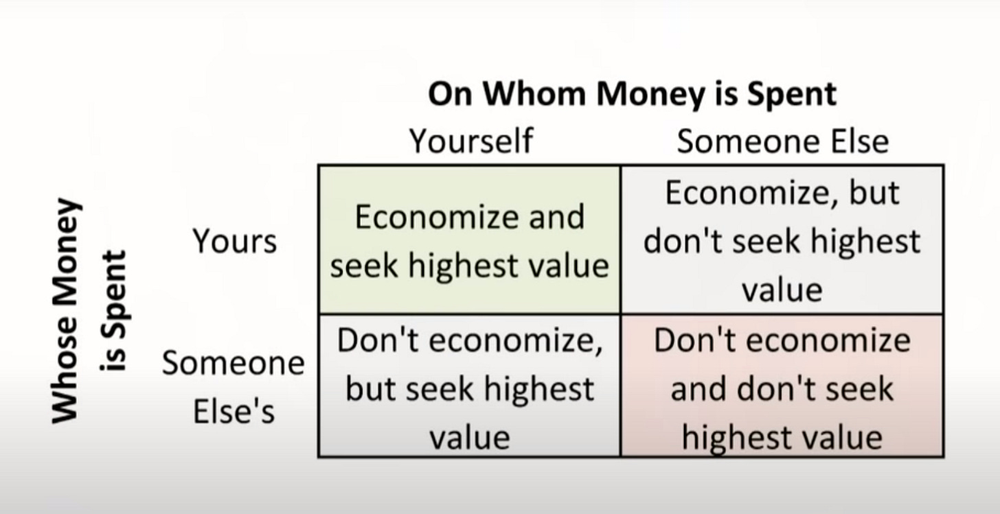

::: {.card-meta}
[Public Policy]{.badge} [public-finance]{.badge} [behavioural-economics]{.badge}
:::

> Welfare spending by governments operates in the lower half of the chart. We either seek higher subsidies for ourselves from taxpayer money, or we seek higher subsidies for someone else at the taxpayer’s expense.

## Origin

The framework combines two sources. First, an experimental paper by Emil Persson and Gustav Tinghög showing that policymakers are six to ten percentage points less likely to invest in a public health programme when reminded that the money could fund other health programmes. Second, Milton Friedman’s "four ways to spend money," which explains *why* opportunity costs are systematically neglected.

## What it says

{fig-alt="Opportunity Cost Neglect"}

Friedman’s quadrants classify spending by source and recipient:

| | **Spend on yourself** | **Spend on someone else** |
|---|---|---|
| **Your own money** | Careful, value-conscious | Careful, but less precise |
| **Someone else’s money** | Less careful, some waste | Least careful, maximum waste |

Government welfare spending sits in the bottom row. Civil servants demanding higher pensions (bottom-left) and elites cheering mid-day meals or farm loan waivers (bottom-right) both neglect what else those rupees could have bought. The money feels free because it is not their own.

Persson and Tinghög provide experimental evidence: simply reminding decision-makers of opportunity costs shifts investment behaviour. The neglect is not inevitable; it is a cognitive bias that can be countered.

## Applied

India’s budget debates are overwhelmingly about *adding* schemes, rarely about *substituting* them. Every new programme — from Ayushman Bharat to PM-KISAN — is evaluated on its own merits, not against the counterfactual of using the same funds for primary health or road maintenance. The Finance Commission’s allocation exercise is one of the few institutional moments where opportunity costs are explicit, which is why it is so politically fraught.

The framework also explains why middle-class subsidies (LPG, railway fares, higher education) survive despite regressive incidence: the beneficiaries are vocal, and the opportunity cost — what those subsidies could fund for the poor — is invisible.

## When it falls short

Constantly invoking opportunity costs can produce paralysis. Not every rupee has a clearly superior alternative use, and "what about X?" can be deployed to block any action. The framework is also weaker when applied to capital investments with long and uncertain payoffs: the opportunity cost of a metro line is speculative, not budget-line explicit.

## Related frameworks

- [Errors of Omission and Commission](errors-of-omission-and-commission.qmd) — the symmetric targeting mistakes that arise when opportunity costs are ignored.
- [Outlays, Outputs, Outcomes](ooo.qmd) — the chain that helps you judge whether a scheme is worth its opportunity cost.
- [Marginal Cost of Public Finance](../public-finance/marginal-cost-of-public-finance.qmd) — what every rupee of outlay actually costs the economy.

## Further reading

- Friedman, M., & Friedman, R. *Free to Choose*.

::: {.attribution}
Originally explored in [*A Framework a Week: Conceptualising Opportunity Cost Neglect*](https://publicpolicy.substack.com/i/137097252/a-framework-a-week-conceptualising-opportunity-cost-neglect) on *Anticipating the Unintended*.
:::
