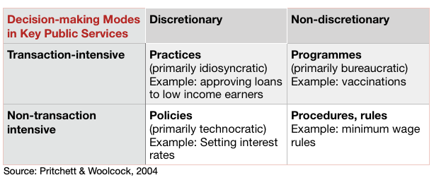
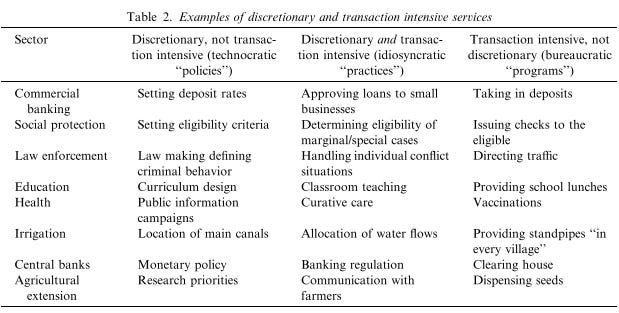

::: {.card-meta}
[Public Policy]{.badge} [state-capacity]{.badge} [implementation]{.badge}
:::

> The Indian state is better off at doing some things such as elections, Kumbh Mela, Polio eradication etc. To make sense of this paradox, the analytical framework of policies, programmes, and practices is quite helpful.

## Origin

The framework comes from a paper by Lant Pritchett and Michael Woolcock on public service delivery, later extended by Devesh Kapur. It was introduced in *Anticipating the Unintended* to explain why the Indian state succeeds at some tasks and fails at others.

## What it says

{fig-alt="Policies vs Programmes vs Practices"}

{fig-alt="Policies vs Programmes vs Practices (detail)"}

In any sector, decision-making falls into four modes depending on two dimensions: **discretion** (how much judgment the agent must exercise) and **transaction intensity** (how many individual transactions the task requires).

| | **Low transaction intensity** | **High transaction intensity** |
|---|---|---|
| **High discretion** | **Policies** — macro decisions by "10 smart people." Setting interest rates, devaluing currency, fiscal targets. | **Practices** — the hardest cell. Teaching, medicine, policing. High judgment × millions of interactions. |
| **Low discretion** | **Procedures** — routinised, automatable. | **Programmes** — scripted implementation at scale. Mass vaccination, retail banking, MGNREGA wage payments. |

The Indian paradox is explained: elections and polio eradication are **programmes** — high transaction intensity but low discretion (follow the script). Education and primary health are **practices** — high discretion and high transaction intensity. That is where the Indian state’s implementation deficit is concentrated.

## Applied

India’s success with COVID-19 vaccination was a programme victory: fixed centres, digital registration, standard protocols. Its struggle with rural primary health is a practices failure: the same ANM must diagnose, counsel, and refer — tasks requiring judgment that cannot be scripted.

The framework also explains why digitisation is transformative. Aadhaar turned welfare identification from a practice (local official decides who is poor) into a programme (match ID against eligibility list). UPI turned retail payments from a practice (branch manager discretion) into a procedure (instant, automated).

## When it falls short

The boundaries are porous. Telemedicine can turn a medical practice into a programme. Algorithmic policing can turn a practice into a procedure — with troubling justice implications. The framework describes the terrain; it does not tell you how to improve practices. That requires investments in human capital, accountability, and organisational culture that no 2×2 matrix can capture.

## Related frameworks

- [Seven Stages of the Policy Pipeline](seven-stages-policy-pipeline.qmd) — where policies, programmes, and practices fit in the chain from fact to law.
- [Public Sector Reform](public-sector-reform.qmd) — uncoupling steering and rowing as a way to improve both programmes and practices.
- [Outlays, Outputs, Outcomes](ooo.qmd) — how to evaluate whether programmes and practices are delivering.

::: {.attribution}
Originally explored in [*A Framework a Week: Policies, Programmes, and Practices*](https://publicpolicy.substack.com/i/303254/a-framework-a-week-policies-programmes-and-practices) on *Anticipating the Unintended*.
:::
