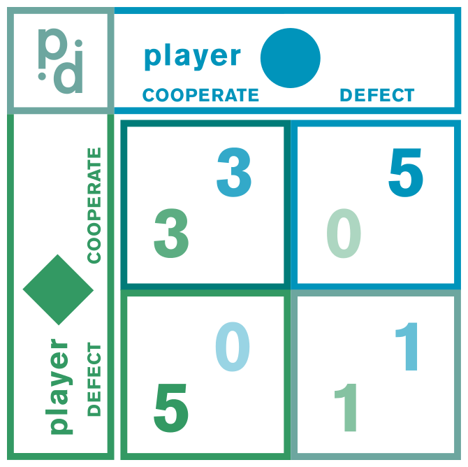

::: {.card-meta}
[Public Policy]{.badge} [game-theory]{.badge} [institutional-design]{.badge}
:::

> How do you get people to do something that is against their interest? Put them in what is known as the prisoners’ dilemma.

## Origin

The framework comes from Avinash Dixit and Barry Nalebuff’s *The Art of Strategy*, applied to policy implementation by *Anticipating the Unintended*. The canonical example is Warren Buffett’s proposal for campaign finance reform, in which an "eccentric billionaire" threatened to donate $1 billion to the party that delivered the most votes for reform — turning incumbents’ self-interest against itself.

## What it says

{fig-alt="Prisoner's Dilemma in Policy Engineering"}

The core implementation challenge in public policy is this: effecting change often requires getting the most powerful stakeholder to act against their own interests. The traditional approach is persuasion or coercion. The game-theoretic approach is **structural**: redesign the payoffs so that the stakeholder’s self-interest now aligns with the reform.

The prisoner's dilemma works because each player’s dominant strategy — the move that is best regardless of what the other does — leads to a collectively worse outcome. If you can embed the reform inside such a payoff structure, stakeholders will "voluntarily" support it.

The policy engineering toolkit has three steps:

1. Identify the most powerful stakeholder(s) with strong personal interests in preserving the status quo.
2. Design a prisoner's dilemma that persuades them to seemingly act against their interests.
3. Embed this dilemma in implementation rules so the outcome repeats across different players and contexts.

## Applied

The Medical Council of India restricted doctor supply because incumbent doctors benefited from scarcity. Liberalising medical education required changing the MCI’s payoffs — for instance, by creating a competing accreditation body that would capture market share if the MCI did not reform, or by tying MCI funding to expansion targets.

Buffett’s campaign-finance example is the cleanest illustration. Without the billionaire’s threat, each party preferred the status quo (unlimited fundraising advantage). With the threat, each party’s dominant strategy flipped to supporting reform — because defecting while the other cooperated would hand the competitor $1 billion.

## When it falls short

Constructing credible dilemmas is hard. It often requires leverage that reformers do not have — Buffett needed an "eccentric billionaire." The dilemma must also be legally and ethically defensible; blackmail is not policy design. Finally, the framework assumes repeated or simultaneous interaction. In one-shot games, cooperation unravels.

## Related frameworks

- [Public Sector Reform](public-sector-reform.qmd) — separating steering and rowing as a structural alternative to game-theoretic manipulation.
- [Understanding Corruption](understanding-corruption.qmd) — why some stakeholders resist reform, and what incentives drive them.
- [Taxonomy of Policy Failures and Successes](taxonomy-of-policy-failures-and-successes.qmd) — how incentive interference produces predictable failure.

## Further reading

- Dixit, A., & Nalebuff, B. *The Art of Strategy*.
- Axelrod, R. *The Evolution of Cooperation*.

::: {.attribution}
Originally explored in [*A Framework a Week: Making Prisoner’s Dilemma a Part of the Policy Engineering Toolkit*](https://publicpolicy.substack.com/i/388702/a-framework-a-week-making-prisoners-dilemma-a-part-of-the-policy-engineering-toolkit) on *Anticipating the Unintended*.
:::
