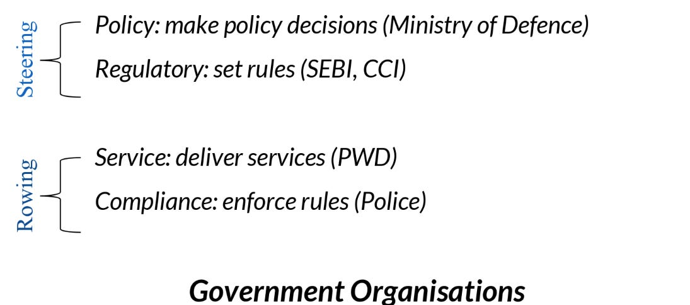

::: {.card-meta}
[Public Policy]{.badge} [state-capacity]{.badge} [governance]{.badge}
:::

> Most government organisations in India cannot be neatly classified. They sometimes perform all four functions at once. So, a key idea for government organisation reform is just to uncouple steering functions from rowing ones.

## Origin

The framework comes from David Osborne and Peter Plastrik’s classic *Banishing Bureaucracy*. It was introduced in *Anticipating the Unintended* as a lens for understanding why Indian public sector reform so often stalls.

## What it says

{fig-alt="Public Sector Reform"}

Government organisations perform four primary functions, which fall into two categories:

**Steering functions** (set direction):
- **Policy** — setting rules and strategy. SEBI decides how capital markets operate.
- **Regulation** — monitoring and enforcing compliance. Pollution control boards set emission standards.

**Rowing functions** (execute direction):
- **Service delivery** — producing goods and services. Air India flew passengers; public schools teach children.
- **Compliance** — enforcing specific orders. Traffic police issue fines; tax officials conduct raids.

The central insight is that **steering and rowing should be uncoupled.** Centralise steering so the state can coordinate direction; decentralise rowing so managers have the autonomy to improve execution. Most Indian organisations — the RBI is a prominent example — perform all four functions simultaneously, blurring accountability and diluting focus.

## Applied

Privatisation is often misunderstood as an ideological choice. In this framework, it is simply the transfer of a **rowing** function (service delivery) from government to private operators, while **steering** (policy and regulation) remains with the state. Air India’s privatisation transferred rowing; the Civil Aviation Ministry retains steering.

The framework also explains why some privatisation efforts fail: when the state privatises rowing but retains neither the capacity nor the will to steer effectively, the result is regulatory capture or consumer exploitation. Conversely, nationalising steering functions (e.g., creating a unified financial regulator) can improve coordination without expanding the state’s operational footprint.

A creative application: reforming the CBFC (film censorship). The Takshashila Institution proposed converting the CBFC from a rowing organisation (it edits films) into a steering organisation (it licenses private Independent Certifying Authorities to rate films). Markets then plug the government failure.

## When it falls short

Some functions genuinely require integration. A central bank needs both policy-setting (steering) and payment-system operation (rowing) to manage monetary transmission. Separating them may create coordination failures. Politics also resists uncoupling: rowing functions offer patronage, contracts, and jobs, which politicians are reluctant to surrender.

## Related frameworks

- [One Instrument, One Target](one-instrument-one-target.qmd) — what happens when a single organisation is asked to steer and row for multiple objectives.
- [Policies vs Programmes vs Practices](policies-vs-programmes-vs-practices.qmd) — the granularity at which steering and rowing actually operate.
- [India’s Three Dimensions of Decentralisation](indias-three-dimensions-of-decentralisation.qmd) — why rowing should be devolved, not just outsourced.

## Further reading

- Osborne, D., & Plastrik, P. *Banishing Bureaucracy*.

::: {.attribution}
Originally explored in [*A Framework a Week: Public Sector Reform*](https://publicpolicy.substack.com/i/258477/a-framework-a-week-public-sector-reform) on *Anticipating the Unintended*.
:::
