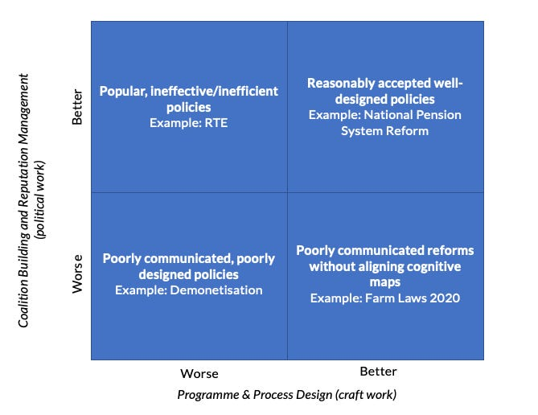

::: {.card-meta}
[Public Policy]{.badge} [evaluation]{.badge} [meta-framework]{.badge}
:::

> What we think of as implementation failures often turn out to be "theory of change" failures under the hood.

## Origin

This is a meta-framework compiled in *Anticipating the Unintended* from multiple editions, drawing on Bovens et al., Patashnik, Allan McConnell, Kelkar & Shah, and Pritchett & Woolcock. It is designed as a diagnostic menu: whenever you witness a policy failure, one of these frameworks might help you classify it.

## What it says

{fig-alt="Taxonomy of Policy Failures and Successes"}

The taxonomy bundles six distinct diagnostic lenses:

**1. The Programmatic–Political Axes**
Policies can be assessed on programmatic efficiency/effectiveness and on political coalition-building. A scheme can be technically sound but politically orphaned, or politically popular but technically hollow.

**2. The Fourfold Measure**
- **Programmatic:** effectiveness and efficiency.
- **Process:** implementation capability.
- **Political:** narrative power and coalition durability.

**3. McConnell’s Spectrum**
Each dimension is graded from outright success → resilient success → conflicted success → precarious success → outright failure. A policy can be an outright success programmatically but precarious politically.

**4. Outlays–Outputs–Outcomes (OOO)**
Breaks the chain: inputs → activities → impacts. A theory-of-change failure occurs when the assumed linkage is wrong (e.g., more school spending → better learning). An implementation failure occurs when the linkage is sound but execution breaks down.

**5. Violating the Tinbergen Rule**
An institution asked to achieve many objectives with one instrument will fail on all of them.

**6. Incentive Interference**
The mother of all failures: ignoring people’s preferences and incentives. Bans, price caps, sticky subsidies, and high tax rates are almost always counterproductive because they meddle with choice.

## Applied

- **Successful process, unsuccessful programme:** Items reserved for manufacture exclusively by the small-scale sector followed parliamentary procedure but produced economic stagnation.
- **Successful politics, unsuccessful programme:** The Bombay Rent Control Act was electorally popular but destroyed rental housing supply.
- **Successful programme, unsuccessful politics:** The Civil Services Pension Reform of 2004 was technically sound, but five states have already reversed it for coalition-building reasons.
- **Short-term success, long-term failure:** Minimum Support Prices for grains and prohibition laws achieve immediate goals but produce adverse unintended consequences over time.

## When it falls short

The taxonomy is neither mutually exclusive nor collectively exhaustive. Some failures span multiple categories. It can also become a checklist obsession: analysts classify without diagnosing, let alone prescribing. The frameworks tell you *what* went wrong; they rarely tell you *how* to fix it.

## Related frameworks

- [Outlays, Outputs, Outcomes](ooo.qmd) — the chain analysis at the heart of the taxonomy.
- [One Instrument, One Target](one-instrument-one-target.qmd) — the Tinbergen rule violation.
- [Errors of Omission and Commission](errors-of-omission-and-commission.qmd) — targeting failures that show up across multiple categories.

::: {.attribution}
Originally explored in [*A Framework a Week: A Taxonomy of Policy Failures and Policy Successes*](https://publicpolicy.substack.com/i/106189420/a-framework-a-week-a-taxonomy-of-policy-failures-and-policy-successes) on *Anticipating the Unintended*.
:::
