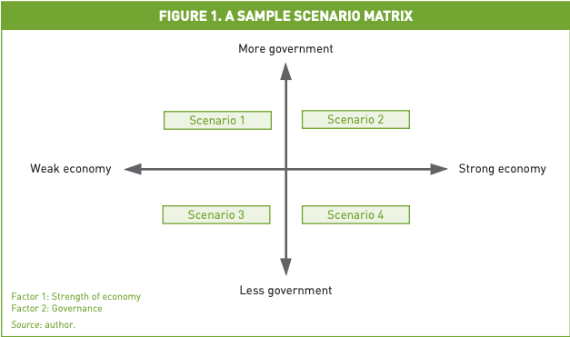
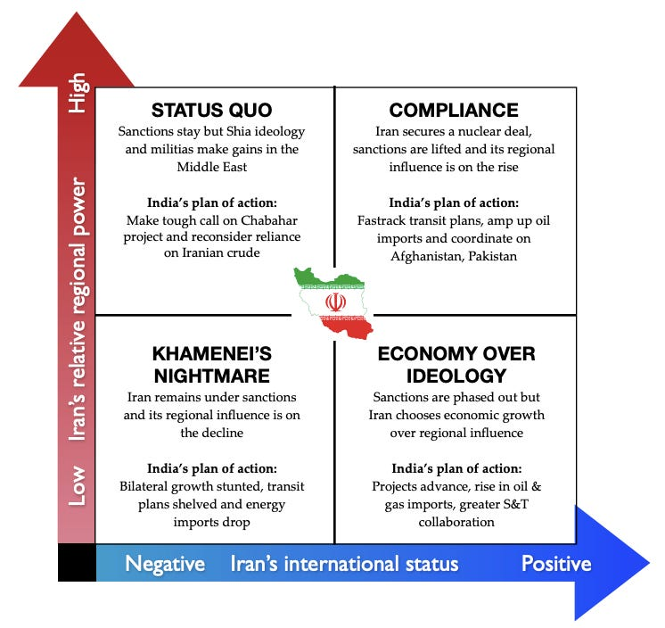

::: {.card-meta}
[Public Policy]{.badge} [design]{.badge} [scenario-planning]{.badge}
:::

> The strength of the 2x2 framework is that it creates robust scenarios at the intersection of two important, independent, and uncertain trends. The weakness is that it ignores the interplay of more variables.

## Origin

The 2x2 matrix is a standard tool in management consulting and strategic planning. Alun Rhydderch of Futuribles International systematised its use in scenario-building in his paper *Scenario Building: The 2x2 Matrix Technique*. Pranay Kotasthane drew on this in the *Anticipating the Unintended* newsletter to argue for its application in public policy.

## What it says

{fig-alt="Two is Better Than One: 2x2 Matrix"}

{fig-alt="Two is Better Than One: example matrix"}

Most informal scenario planning varies a single factor along a linear scale. The 2x2 framework improves on this by forcing the analyst to identify the **two most important and most uncertain drivers** of a focal issue, then map four scenarios at their intersections.

Rhydderch proposes an eight-step method: identify the focal issue, scan internal dynamics, locate driving forces, rank them by importance and uncertainty, select the scenario logic, flesh out the quadrants, derive implications, and choose leading indicators. The crucial discipline is Step 4: if the two chosen drivers are not genuinely independent, the matrix collapses into two diagonals rather than four cells.

The framework is not a prediction engine. It is a tool for **stress-testing strategy** against multiple futures and spotting signposts that tell you which future is emerging.

## Applied

- When asking how a US-China decoupling might impact India's trade and technology choices.
- When planning long-term infrastructure investments where demand and regulatory environments are both highly uncertain.
- When preparing for coalition negotiations where two independent variables — say, fiscal space and political fragmentation — shape the bargaining space.

## When it falls short

The framework can seduce analysts into false precision. Filling four quadrants with colourful narratives is easier than rigorously identifying truly independent drivers. It also privileges the two most uncertain variables, which may not be the two most consequential. Finally, it is static: it captures a moment in time, not the dynamics that might push the system from one quadrant to another.

## Related frameworks

- [[How to Build a Good 2x2 Matrix]](../universe/how-to-build-a-good-2x2-matrix.qmd) — a complementary guide to constructing meaningful axes.
- [[Seven Stages of the Policy Pipeline]](../public-policy/seven-stages-policy-pipeline.qmd) — where scenario planning fits in the policy process.
- [[Wicked Problems]](../public-policy/wicked-problems.qmd) — when the uncertainty is too deep for any matrix to contain.

## Further reading

- [Original newsletter essay](https://publicpolicy.substack.com/p/198-how-to-build-in-india)

::: {.attribution}
Originally explored in [*A Framework a Week: Two is Better Than One*](https://publicpolicy.substack.com/p/198-how-to-build-in-india) on *Anticipating the Unintended*.
:::
