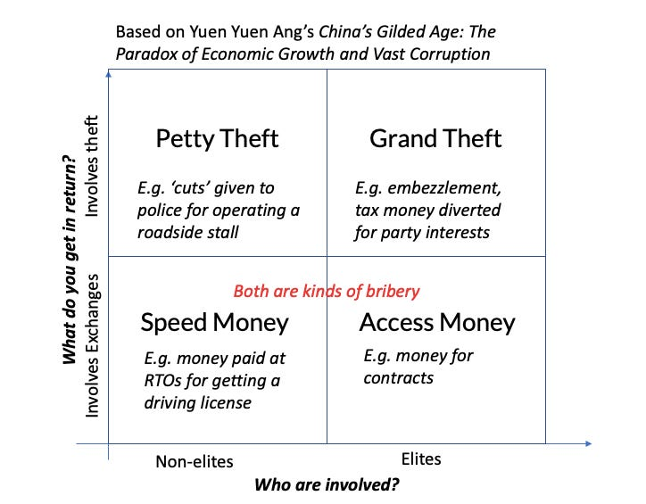

::: {.card-meta}
[Public Policy]{.badge} [political-economy]{.badge} [institutional-design]{.badge}
:::

> All corruption is bad — they are all drugs — but petty theft and grand theft are like toxic drugs; speed money is like painkillers; access money is like anabolic steroids — they help you grow rapidly but come with serious side effects that accumulate over time.

## Origin

The framework comes from Yuen Yuen Ang’s *China’s Gilded Age: The Paradox of Economic Growth and Vast Corruption*. Ang classifies corruption on two axes — who in government engages, and whether the money-giver gets something in return — producing four distinct types. The *Anticipating the Unintended* newsletter adapted it for the Indian context.

## What it says

{fig-alt="Understanding Corruption"}

| | **Money-giver gets nothing** | **Money-giver gets something** |
|---|---|---|
| **Low-level bureaucrat** | **Petty theft** — embezzlement, skimming. | **Speed money** — bribes to expedite routine services. |
| **Political elite** | **Grand theft** — large-scale embezzlement. | **Access money** — quid pro quo for contracts, licenses, policy favours. |

Ang’s central claim is that corruption does not vanish with development; it **migrates.** Low-income countries are dominated by petty theft and speed money. As incomes rise, corruption institutionalises into access money — bribes given to political elites with explicit returns. Access money functions as an incentive system for politicians and capitalists to cooperate on large projects, especially infrastructure.

The book’s analogy is sharp: access money is anabolic steroids. It produces feverish growth — cheap loans, subsidies, state backing — but side effects accumulate: inequality, environmental damage, financial fragility.

## Applied

India’s dominant mode, according to Ang’s framework, is **speed money** — low-level bribes for driving licenses, property registration, building permits. This is less glamorous than grand theft or access money, but it is pervasive, regressive, and corrosive to state legitimacy.

China, by contrast, is dominated by **access money** — elites paying for access to policy favours. That helps explain how China built world-class infrastructure in two decades while India struggles with highway completion: access money aligns elite incentives with project delivery, even as it distorts the economy.

The framework cautions against expecting corruption to disappear. As India grows, the challenge is not to eliminate corruption but to prevent its migration from speed money to access money — or, if it does migrate, to ensure the side effects are contained.

## When it falls short

Ang’s empirical basis is thin: the classification rests on a survey of fifteen experts. The categories can overlap — a bribe to a mid-level official may be both speed money and access money. And "access money" shades into legitimate lobbying and campaign finance, making the boundary politically contested.

## Related frameworks

- [Prisoner’s Dilemma in Policy Engineering](prisoners-dilemma-in-policy-engineering.qmd) — how to redesign incentives so that corruption is no longer the dominant strategy.
- [Public Sector Reform](public-sector-reform.qmd) — separating steering and rowing as a structural check on access money.
- [Taxonomy of Policy Failures and Successes](taxonomy-of-policy-failures-and-successes.qmd) — how corruption shows up across multiple dimensions of failure.

## Further reading

- Ang, Y. Y. *China’s Gilded Age: The Paradox of Economic Growth and Vast Corruption*.

::: {.attribution}
Originally explored in [*A Framework a Week*](https://publicpolicy.substack.com/i/34985111/a-framework-a-week) on *Anticipating the Unintended*.
:::
