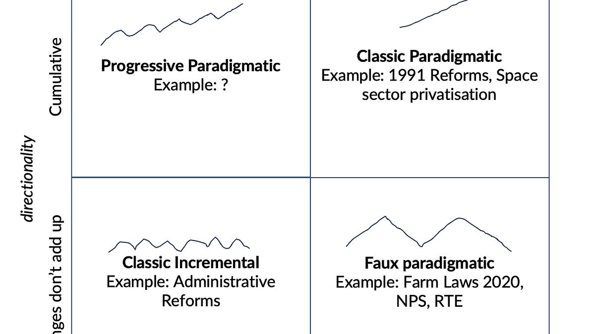

::: {.card-meta}
[Public Policy]{.badge} [political-economy]{.badge} [institutions]{.badge}
:::

> A swift policy change that is reversed and sent back to its original position is not paradigmatic reform. It is a faux paradigmatic move — and it leaves the system worse than where it started.

## Origin

The framework comes from Benjamin Cashore and Michael Howlett's work on super-wicked policy problems, particularly their 2012 paper *Overcoming the Tragedy of Super Wicked Problems: Constraining our Future Selves to Ameliorate Global Climate Change*. Pranay Kotasthane applied it to the Indian farm laws debate in the *Anticipating the Unintended* newsletter.

## What it says

{fig-alt="What Makes a Policy Chance Stick?"}

Cashore and Howlett map policy reform on two axes. The first is **tempo**: is the change incremental or paradigmatic (a step-jump)? The second is **cumulative directionality**: do changes add up to a new equilibrium, or do they fluctuate around the status quo?

The resulting 2x2 yields four reform mechanics. The upper quadrants — incremental and paradigmatic changes that accumulate — move the system to a new equilibrium. The lower quadrants represent change that does not stick. The farm laws of 2020 sit in the "faux paradigmatic" cell: a swift, paradigmatic change that was reversed, leaving the domain behind its starting point.

For reform to stick, three path-dependent processes must be triggered:
- **Lock-in:** the intervention has immediate durability, making reversal difficult.
- **Self-reinforcement:** the costs of reversing increase over time as support grows.
- **Positive feedback:** support expands beyond the initial target population, reinforcing the original coalition.

## Applied

- When designing structural reforms that will face intense opposition at launch and need to survive the first electoral cycle.
- When sequencing a reform agenda: front-load changes that create constituencies with a vested interest in the new equilibrium.
- When evaluating whether a celebrated "big bang" announcement has built any of the three sticky conditions.

## When it falls short

The framework is better at classifying failed reforms than at prescribing successful ones. It does not tell you *how* to generate lock-in or positive feedback; it only tells you what to look for. It also treats politics as somewhat mechanical, when in reality stickiness depends on contingency, leadership, and events that no framework can plan for.

## Related frameworks

- [[The Overton Window]](../political-thinking/overton-window.qmd) — how the bounds of acceptable opinion shape what reforms are even attemptable.
- [[Kingdon's Three Streams]](../political-thinking/kingdon-three-streams.qmd) — why reform windows open and close.
- [[Wicked Problems]](../public-policy/wicked-problems.qmd) — when the problem itself resists clean definition and solution.

## Further reading

- [Original newsletter essay](https://publicpolicy.substack.com/p/281-causes-and-reasons-effects-and)

::: {.attribution}
Originally explored in [*A Framework a Week: What Makes a Policy Chance Stick?*](https://publicpolicy.substack.com/p/281-causes-and-reasons-effects-and) on *Anticipating the Unintended*.
:::
