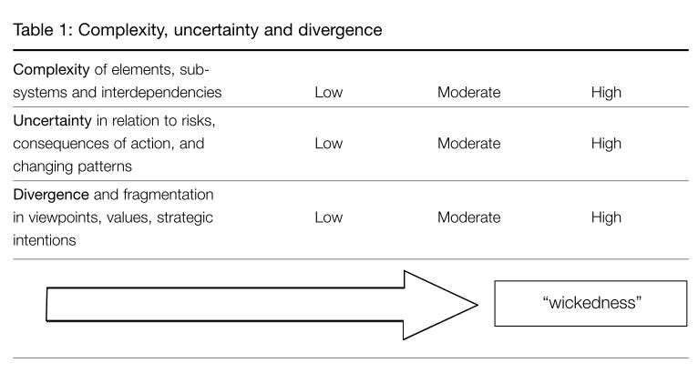

::: {.card-meta}
[Public Policy]{.badge} [problem-definition]{.badge} [diagnosis]{.badge}
:::

> Some policy problems are not difficult because we lack data or money. They are difficult because we cannot agree on what the problem is, what counts as a solution, or how urgently to act.

## Origin

The term "wicked problems" was coined by Horst Rittel and Melvin Webber in their 1973 paper *[Dilemmas in a General Theory of Planning](https://link.springer.com/article/10.1007/BF01405730)*. They argued that the "tame" problems of science and engineering — well-defined, with stopping rules and clear right-or-wrong answers — were a poor model for the social planning problems governments actually face.

The framework was extended for public policy by Brian Head in his 2008 paper *Wicked Problems in Public Policy*, which is the version Pranay drew on in *Anticipating the Unintended*.

## What it says

{fig-alt="Wicked Problems"}

A wicked problem is one where three things are simultaneously hard:

1. **Defining the problem is itself contested.** Different stakeholders see different problems in the same situation. There is no neutral problem statement waiting to be discovered.
2. **Solutions are not evident.** Each potential intervention is a one-shot experiment with consequences that cannot be reversed. There is no "test, fail, iterate" cycle.
3. **Urgency is unsettled.** Some see the issue as the most pressing of our age; others see no problem at all.

A useful diagnostic: a problem is *more wicked* the higher it scores on each of these three dimensions. Climate change a decade ago ranked high on all three. As scientific consensus and public concern have grown, it has become less wicked over time — even if its scale has not shrunk.

## Applied

The classic policy mistake — the one this framework is most useful for catching — is **defining a problem as the absence of your preferred solution**.

A weak framing: *"Government school teachers are paid less than they should be."* That sentence smuggles in a single solution (raise teacher salaries) and forecloses every other path.

A stronger framing of the same situation: *"Only half the children in class 5 can read a class 2 textbook."* That sentence opens up many possible interventions — teacher training, learning materials, accountability reforms, parental engagement, structured pedagogy, all of them in scope.

A working hack drawn from this framework: a public policy problem is not yet a problem unless you can name **at least three mutually exclusive solutions** to address it. Until then, you are working on a solution looking for a justification, not a problem looking for a solution.

## When it falls short

The framework does not give you a method for solving wicked problems — only for recognising them. That is honest, but it can be unsatisfying when you actually need to act. Worse, "wicked problem" can become an excuse: a label that justifies indefinite analysis or admits learned helplessness.

It also flattens the variety inside the category. Climate change, communal violence, and urban congestion are all "wicked", but the political coalitions, time horizons, and tools that work for each are very different. The framework is a first cut, not a method.

## Related frameworks

- [Hyper Multi-Objective Optimisation](hyper-multi-objective-optimisation.qmd) — why pursuing many goals at once is the structural cause of wickedness.
- [Good Policy Problem Definition](good-policy-problem-definition.qmd) — the criteria that separate a usable problem statement from a hidden solution.
- [Confronting Trade-offs](../political-thinking/confronting-trade-offs.qmd) — how to reason once you accept that no choice will satisfy everyone.

## Further reading

- Rittel, H., & Webber, M. (1973). *Dilemmas in a General Theory of Planning*. Policy Sciences, 4(2), 155–169.
- Head, B. W. (2008). *Wicked Problems in Public Policy*. Public Policy, 3(2), 101–118.

::: {.attribution}
Originally explored in [*A Framework a Week*](https://publicpolicy.substack.com/i/169367/india-policy-watch) on *Anticipating the Unintended*.
:::
