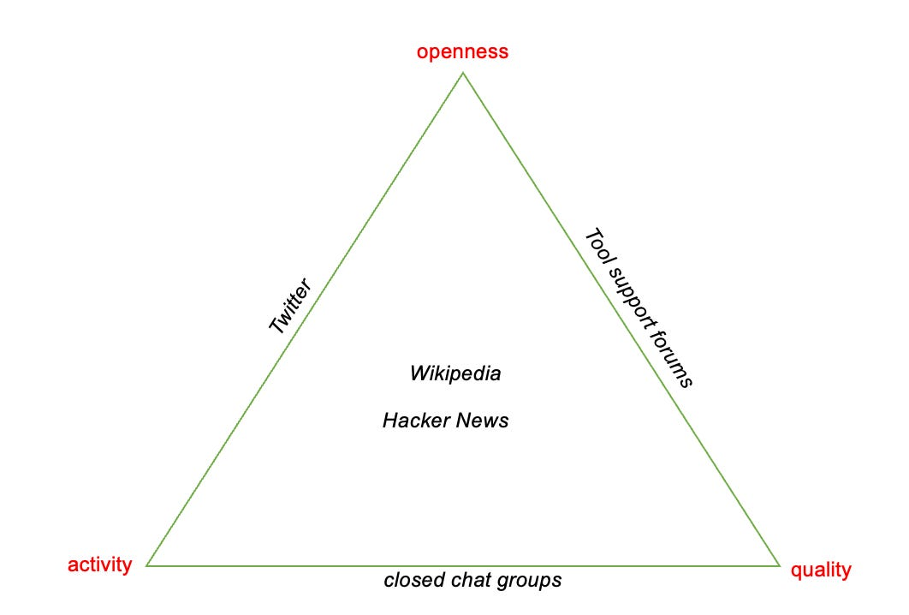

::: {.card-meta}
[Society]{.badge} [digital-governance]{.badge} [collective-action]{.badge}
:::

> The rare digital communities that have transcended this trilemma are Wikipedia and HackerNews. Are there others I have missed?

## Origin

This is my framework formulating digital community design as a trilemma among three desirable but mutually incompatible goals.

## What it says

{fig-alt="Building Digital Communities"}

Most online communities can achieve only two of the following three objectives:

- **Openness:** How easy it is for an outsider to join and participate. High openness means low barriers to entry.
- **Health or quality:** Is there scope for good-faith disagreement? Is the space free of cancel culture, bigotry, and bad-faith actors?
- **Activity:** How often do conversations happen? High activity requires a constant influx of new participants and topics.

Open communities that are highly active almost always degrade in quality. Closed communities that maintain quality tend to wither in activity. The few that manage all three — Wikipedia and HackerNews being the most cited — do so through a specific mechanism: **endogenous population loss**.

Wikipedia did not start as a high-quality encyclopedia. In its early years, it was a dubious source. Over time, early disputes over rule interpretation demobilised fringe-content editors while mobilising those committed to reliability. The undesirable elements departed or were ousted. The population loss of bad-faith actors, combined with escalating privileges for committed contributors, produced institutional change from within.

## Applied

India's experience with large WhatsApp groups and neighbourhood apps illustrates the trilemma. Groups with open membership and high message volume typically collapse into forwarded spam and polarisation. Groups that enforce strict moderation rules often become echo chambers with declining participation.

The framework suggests that community builders should introduce **friction by design**: not all members should have the same privileges. Reputation systems, tiered access, and graduated sanctions are not elitist — they are prerequisites for quality at scale.

## When it falls short

The Wikipedia model assumes a shared baseline commitment to some objective truth. In politically polarised contexts, what one faction calls "fringe content" another calls legitimate dissent. Population loss then becomes purging, and the community hardens into an echo chamber.

The framework also understates the role of platform incentives. Wikipedia is a non-profit with no advertising model. Commercial platforms that optimise for engagement will always prioritise activity over health, whatever their community guidelines say.

## Related frameworks

- [Radically Networked Societies](radically-networked-societies.qmd) — how digital networks reshape social structures.
- [Why Large WhatsApp Groups Are So Ineffective](why-large-whatsapp-groups-are-so-ineffective.qmd) — collective action failures in large digital groups.
- [How Social Norms Flip](how-social-norms-flip.qmd) — norm change as a sequenced intervention.

## Further reading

- Steinsson, S. (2023). Rule Ambiguity, Institutional Clashes, and Population Loss: How Wikipedia Became the Last Good Place on the Internet. *American Political Science Review*

::: {.attribution}
Originally explored in [*A Framework a Week: Building Digital Communities*](https://publicpolicy.substack.com/i/139148108/a-framework-a-week-building-digital-communities) on *Anticipating the Unintended*.
:::
