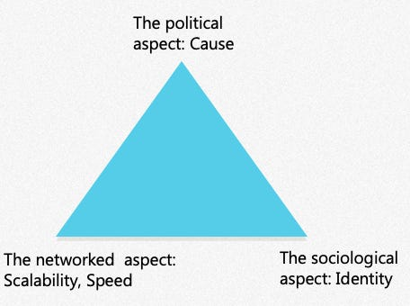

::: {.card-meta}
[Society]{.badge} [networks]{.badge} [mobilisation]{.badge}
:::

> The clash we see today is between contemporary hierarchically ordered states and their radically networked societies. Information flows much faster in a network than in a hierarchy. States are struggling at counter-mobilisation.

## Origin

The concept was developed by Nitin Pai at the Takshashila Institutio. The term captures something deeper than "social media activism": it describes a structural transformation in how societies are organised.

## What it says

{fig-alt="Radically Networked Societies"}

A **Radically Networked Society (RNS)** is a web of connected individuals who share an identity (imagined or real) and are motivated by a common immediate cause.

The concept has three dimensions:

**Scalability.** In the past, mobilising a thousand people required institutions — unions, parties, temples, mosques. The internet makes it possible to assemble a crowd of millions with no institutional backbone. A hashtag and a grievance are sufficient.

**Speed.** Information and emotion travel faster in a network than through a hierarchical chain of command. A state learns about a protest through its intelligence apparatus hours after the protesters have already coordinated, assembled, and dispersed.

**Depth.** The internet does not just amplify existing identities; it creates new ones. Causes that would have remained latent — a shared frustration with a film, a sudden price rise, a viral video — crystallise into collective identity overnight.

The result is a structural mismatch: states are hierarchies with slow feedback loops; societies are networks with fast ones. When a networked society mobilises against a hierarchical state, the state is always playing catch-up.

## Applied

The 2019-20 protests against the Citizenship Amendment Act illustrated all three dimensions. Mobilisation scaled from local university campuses to nationwide demonstrations without a central command. Coordination happened through WhatsApp forwards and Instagram stories faster than any political party could match. And a new identity — the "protesting citizen" — was forged in real time through shared hashtags and slogans.

The farmers' protests of 2020-21 showed the same pattern at even larger scale. The state attempted hierarchical responses: roadblocks, internet shutdowns, legal charges. The network adapted: VPNs, alternative routes, international amplification. The hierarchy could slow the network but could not outpace it.

The diagnostic value: when a government faces a spontaneous, leaderless, digitally-coordinated protest, it is not facing a law-and-order problem. It is facing a structural mismatch between its own operating system and that of its population.

## When it falls short

Not every online crowd is an RNS. Many viral mobilisations are shallow — broad but thin. They assemble quickly and dissolve just as fast. The Arab Spring showed that networked mobilisation can topple regimes but struggles to build new institutions. Speed is an advantage in protest; it is a disadvantage in governance.

The framework also risks overstating the novelty. Networks have always existed — caste councils, religious congregations, trade guilds. What changed is the speed and scale, not the underlying social structure. A village panchayat was a network too; it just had slower feedback loops.

Finally, the framework can romanticise networks. Networks are also echo chambers, misinformation amplifiers, and lynch mobs. The same structure that enables horizontal solidarity also enables horizontal violence.

## Related frameworks

- [Internet and Politics](internet-and-politics.qmd) — the six pathways through which digital networks reshape political life.
- [Building Digital Communities](building-digital-communities.qmd) — strategies for making online groups sustainable.
- [Why We Do Stupid Things in Groups](why-we-do-stupid-things-in-groups.qmd) — collective irrationality in networked settings.

## Further reading

- Takshashila Institution, *Liberty & Security in Radically Networked Societies*.
- Takshashila Institution, *Networked Societies and Hierarchical States: The Emerging Challenge to Political Order*.
::: {.attribution}
Originally explored in [*The March of Radically Networked Societies*](https://publicpolicy.substack.com/i/154262/the-march-of-radically-networked-societies) on *Anticipating the Unintended*.
:::
