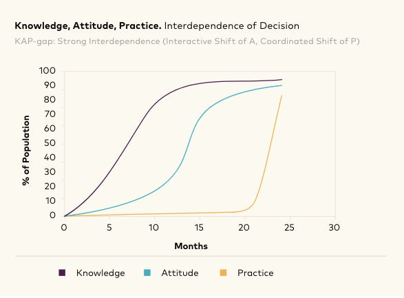

::: {.card-meta}
[Society]{.badge} [behaviour]{.badge} [institutions]{.badge}
:::

> Social failures — such as open defecation or female genital mutilation — persist not because individuals prefer them, but because everyone's compliance depends on what everyone else does and expects.

## Origin

The theory of social norms and social change was pioneered by ethicist and psychologist Cristina Bicchieri at the University of Pennsylvania, developed over fifteen years of empirical and theoretical work and summarised in *Norms in the Wild* (2017).

## What it says

{fig-alt="Social Norms and Public Policy"}

Social norms are a subset of norms where a practice survives on two concurrent expectations:

- **Empirical expectations:** I do something because everyone around me is doing it.
- **Normative expectations:** I believe others expect me to behave that way.

When both align, the norm is stable. A social failure occurs when the practice is harmful yet self-sustaining because no individual can unilaterally deviate without sanction. Policy intervention must therefore target *expectations*, not just incentives. The Swachh Bharat Abhiyan applied this insight by combining visible behaviour change with community messaging to shift both empirical and normative expectations around open defecation.

## Applied

- When designing behaviour-change campaigns where individual incentives are swamped by social pressure.
- When assessing why a harmful practice persists despite being privately rejected by many participants.
- When sequencing enforcement: making norm-breaking visible before raising penalties.

## When it falls short

The framework requires fine-grained data on reference networks and expectations that is expensive to collect at scale. It also struggles when norms are fused with identity — caste, religion, or partisan affiliation — because empirical expectations are reinforced by in-group solidarity rather than mere frequency of behaviour.

## Related frameworks

- [[How Social Norms Flip]](../society/how-social-norms-flip.qmd) — the sequencing of interventions to shift entrenched norms.
- [[Radically Networked Societies]](../society/radically-networked-societies.qmd) — how digital networks reshape reference groups.
- [[Why We Do Stupid Things in Groups]](../society/why-we-do-stupid-things-in-groups.qmd) — collective irrationality as a norm-driven phenomenon.

## Further reading

- Bicchieri, C. (2017). *Norms in the Wild: How to Diagnose, Measure, and Change Social Norms*. Oxford University Press.
- [Original newsletter essay](https://publicpolicy.substack.com/p/169-the-past-is-a-foreign-country)

::: {.attribution}
Originally explored in [*A Framework a Week: Social Norms and Public Policy*](https://publicpolicy.substack.com/p/169-the-past-is-a-foreign-country) on *Anticipating the Unintended*.
:::
