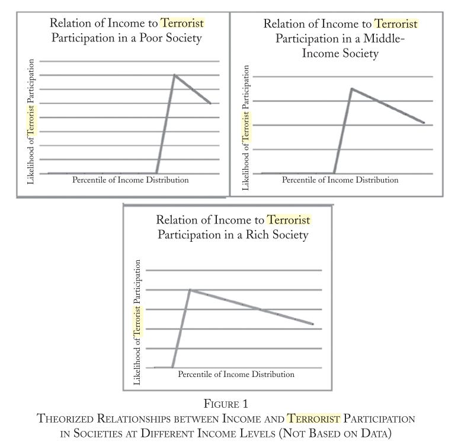

::: {.card-meta}
[Society]{.badge} [political-violence]{.badge} [development]{.badge}
:::

> Below a socioeconomic threshold, terrorism actually becomes less likely.

## Origin

The framework draws on Alexander Lee's 2011 paper on the socioeconomic foundations of terrorism. It challenges the intuitive but empirically weak claim that poverty and lack of education are direct drivers of political violence.

## What it says

{fig-alt="Terrorism, Poverty, and Education"}

The relationship between terrorism, poverty, and education is non-linear and counter-intuitive:

**Below a socioeconomic threshold, terrorism is less likely.** Individuals in extreme poverty lack the political information, disposable time, and politically salient social contacts required for participation in violent political activity. They are too busy surviving to engage in terrorism.

**Above the threshold, participation rises with education and wealth.** The politically involved tend to be relatively wealthy and well educated because they have access to political information and can afford to devote time and energy to political causes.

**Within this educated, politicised subgroup, the actual perpetrators of violence skew lower-status.** Higher opportunity costs of violence deter the richest individuals. The members of violent groups therefore tend to be lower-status individuals drawn from the educated and politicised section of the population — not the poorest or the least educated.

This predicts an uncomfortable implication: as a society becomes more prosperous, a larger share of its population is likely to become politically involved, including in the use of terror.

## Applied

The framework explains why micro-level development programmes — vocational training, microfinance, education subsidies — have limited direct effect on terrorism risk. If the participants are below the threshold, they were not likely to become terrorists anyway. If they are above it, education and political awareness may actually increase their propensity for political engagement, including violent forms.

Counter-terrorism policy that focuses exclusively on poverty alleviation as a preventive tool is addressing the wrong variable. The more relevant levers are the political information environment, the nature of social networks, and the opportunity costs of violence for educated young men.

## When it falls short

The framework is probabilistic, not deterministic. Individual terrorists come from every socioeconomic background. It does not explain lone-wolf attacks, which often involve mental health factors and online radicalisation pathways distinct from organised political violence.

It also does not address ideological motivation. Education and political awareness are necessary but not sufficient for terrorism; a mobilising narrative or grievance is still required. The framework tells us who is available for recruitment, not why they are recruited.

## Related frameworks

- [Why People Rebel](why-people-rebel.qmd) — the grievance and opportunity structure behind political violence.
- [Radically Networked Societies](radically-networked-societies.qmd) — how digital networks reshape political mobilisation.

## Further reading

Lee, Alexander. 2011. “Who Becomes a Terrorist?: Poverty, Education, and the Origins of Political Violence.” World Politics 63 (2): 203–45. https://doi.org/10.1017/s0043887111000013.
‌

::: {.attribution}
Originally explored in [*A Framework a Week: Terrorism, Poverty, and Education*](https://publicpolicy.substack.com/i/202594/a-framework-a-week-terrorism-poverty-and-education) on *Anticipating the Unintended*.
:::
