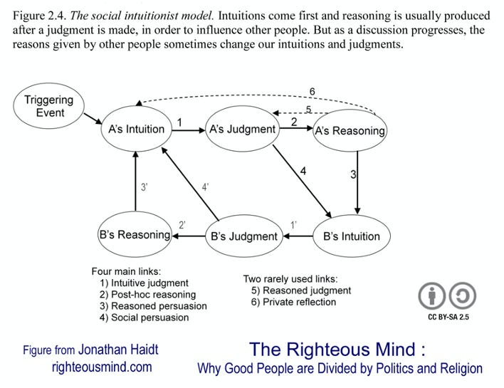

::: {.card-meta}
[Society]{.badge} [moral-psychology]{.badge} [polarisation]{.badge}
:::

> The mind is divided into parts that sometimes conflict. Like a rider on the back of an elephant, the conscious, reasoning part of the mind has only limited control of what the elephant does.

## Origin

The framework draws on Jonathan Haidt's *The Righteous Mind* and his earlier paper *The Emotional Dog and Its Rational Tail*. Haidt challenged the rationalist model of morality — associated with Lawrence Kohlberg's six stages of moral reasoning — with a social intuitionist alternative.

## What it says

{fig-alt="The Basis of Morality"}

Haidt proposes two linked ideas that explain why moral disagreements are so intractable.

**The social intuitionist model.** Moral judgment is not driven by moral reasoning. It is driven by moral intuition — the sudden appearance in consciousness of a moral judgment, complete with affective valence, without conscious awareness of having weighed evidence. We feel that something is wrong, and only then construct reasoning to support that feeling. Haidt's elephant-rider metaphor captures this: the elephant (intuition) chooses the path; the rider (reason) offers post-hoc justifications.

**Moral foundation theory.** Humans share six innate moral foundations that develop differently across cultures and political orientations:

1. **Care/harm:** Sensitivity to suffering and nurturance.
2. **Fairness/cheating:** Justice, reciprocity, and proportionality.
3. **Loyalty/betrayal:** In-group solidarity and patriotism.
4. **Authority/subversion:** Respect for hierarchy and tradition.
5. **Sanctity/degradation:** Disgust, purity, and the elevation of the sacred.
6. **Liberty/oppression:** Reactance against domination and restriction.

The political disagreement arises because liberals weigh Care and Fairness far more heavily, while conservatives draw on all five (or six) foundations more evenly. Each side literally feels different things when confronted with the same issue.

## Applied

In Indian policy debates — farm laws, citizenship, personal laws — participants on both sides are convinced they hold the stronger moral argument. The framework suggests they are not being disingenuous. They are genuinely experiencing different moral intuitions. A liberal sees the farm laws through Care (farmer distress) and Fairness (corporate capture). A conservative sees the same laws through Liberty (freedom from state control) and Sanctity (protection of traditional agrarian life).

Effective persuasion requires stepping into the other's moral matrix, not merely bombarding them with facts that confirm your own.

## When it falls short

The framework has been criticised for culturally specific sampling — much of the empirical work draws on American liberals and conservatives. Whether the same foundation weights apply to Indian political axes (statist vs. free-market, Hindu nationalist vs. secular, caste-based vs. meritocratic) is an open question.

It also risks reifying moral intuitions as unchangeable. While intuitions are powerful, they are not immutable. New experiences, relationships, and institutions can shift the elephant's path over time.

## Related frameworks

- [How Social Norms Flip](how-social-norms-flip.qmd) — norm change as a mechanism for shifting moral intuitions.
- [Three Truths of Ideology](three-truths-of-ideology.qmd) — how ideological commitments structure moral perception.

## Further reading

- Haidt, J. (2012). *The Righteous Mind: Why Good People Are Divided by Politics and Religion*. Pantheon.
- Haidt, J. (2001). "The Emotional Dog and Its Rational Tail." *Psychological Review*.

::: {.attribution}
Originally explored in [*A Framework a Week: The Basis of Morality*](https://publicpolicy.substack.com/i/31819140/a-framework-a-week-the-basis-of-morality) on *Anticipating the Unintended*.
:::
